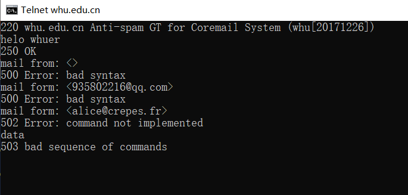
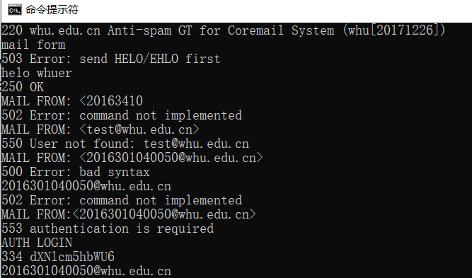
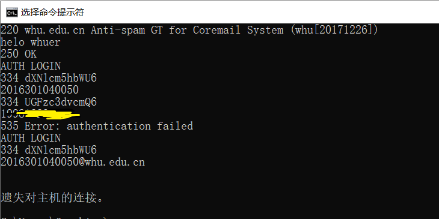
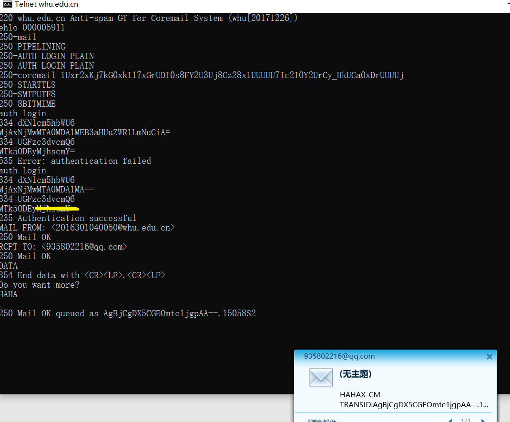
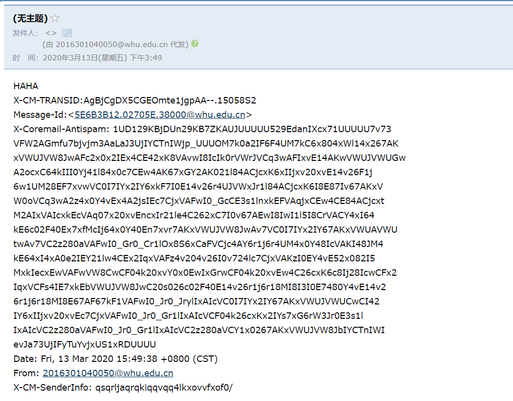
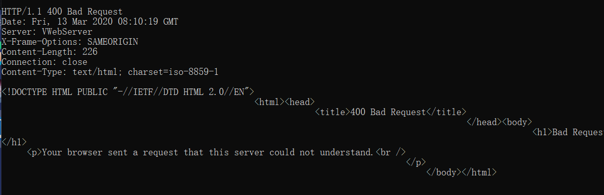
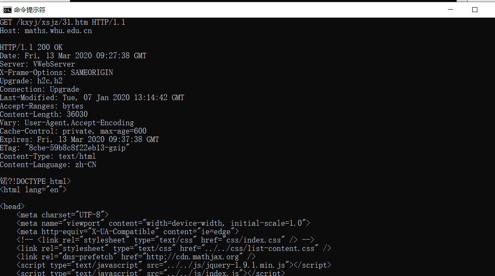

# 第三次作业

## 尝试使用telnet发送邮件

连接成功但发送失败。

想要发送但是要使用存在的账户，当使用存在账户时却需要登录。

当我登录时，使用学号是无法登录的，但键入邮箱地址却直接遗失连接。

最终百度得知，需要对用户名和密码使用Base64加密后的字符串登录才能成功，由于不确定唯一标识是使用学号还是学号@whu.edu.cn，于是试了两次才成功。并且给我的qq邮箱发邮件，截图可以看到成功了。

但得到的内容似乎和我发的内容差别较大，他似乎将头信息也一起发了过来，并且还对信的内容进行了加密。

## http连接

当我输入后，结果是bad request. 我反复确认输入没有问题。然后百度，发现是需要输入'ctrl+]',回车之后再输入get命令才能得到，正确返回如下所示：

## 第二章习题

### p4

a. URL是 gaia.cs.umass.edu/cs453/index.html

b. 使用的http1.1版本

c.  由于http1.1默认使用长连接，且请求头中也发现 Connection : keep-alive，所以该连接是持续连接

d. 该报文中只能看到host，但没有对应的ip地址

e. 发送报文的浏览器类型是 Mozilla/5.0,服务器需要浏览器类型信息将同一对象的不同版本发送到不同类型的浏览器。

### p5

a. 状态代码200和短语ok表示服务器能够成功找到。回答时间在Date中为 Tue, 07 Mar 2008 12:39:45 GMt

b. 上一次修改文档的时间在 Last-Modified中，为 Sat, 10 Dec2005 18:27:46 GMT

c. 返回的文档中有3874个字节。

d. 返回文件的前五个字节是: <!doc                                        

​	是持久连接

### P6

a. 是的

b. http不提供任何加密服务。

c. 不能

d. 是。在服务器决定关闭空闲连接的同时，客户端可能已经开始发送新请求。从服务器的角度来看，连接是在空闲时关闭的，但从客户端的角度来看，请求正在进行中。