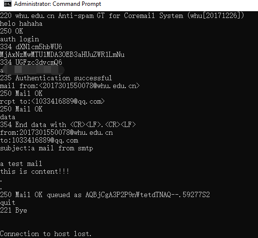
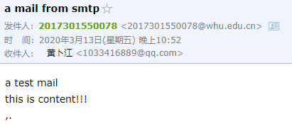
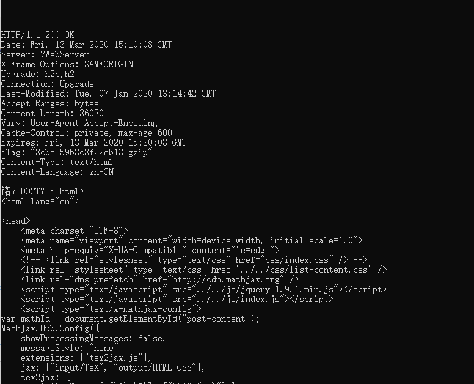

## Homework3
### 1. telnet whu.edu.cn 25
命令行交互截图如下:  
  
邮箱收到了来自whu.edu.cn的邮件：  

### 2. telnet maths.whu.edu.cn 80
输入内容为：
~~~
GET /kxyj/xsjz/31.htm HTTP/1.1
Host: maths.whu.edu.cn
~~~
结果如下： 

### 3. 课后习题
P7. 获取IP地址需要的时间为：
$$RTT_1+RTT_2+...+RTT_n$$
获取IP地址之后首先需要一个$RTT_0$的时间进行TCP握手的前两部，然后握手的第三歩和HTTP请求数据一起发出，耗时$RTT_0$，总耗时为：
$$2*RTT_0+RTT_1+RTT_2+...RTT_n$$
 
P8.  
a) 每次请求小文件都需要建立TCP连接并获取文件，所以每个小文件耗时$2*RTT_0$，总耗时：
$$18*RTT_0+RTT_1+RTT_2+...+RTT_n$$  
b) 有5个并行连接时，首先需要$2*RTT_0$的时间获取到HTML文件，然后再分两次，分别获取5个与3个小对象，耗时$2*2*RTT_0$，总耗时为：
$$6*RTT_0+RTT_1+RTT_2+...+RTT_n$$  
c) 假设没有并行连接，则第一次请求HTML需要TCP握手，耗时$2*RTT_0$，后面的8个小文件各耗时$RTT_0$，总耗时：
$$10*RTT_0+RTT_1+RTT_2+...+RTT_n$$