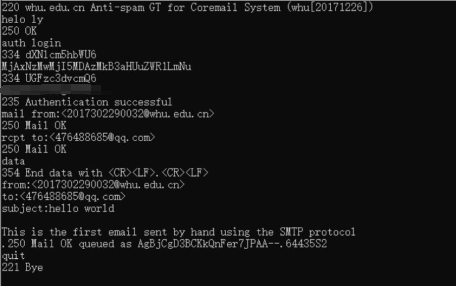
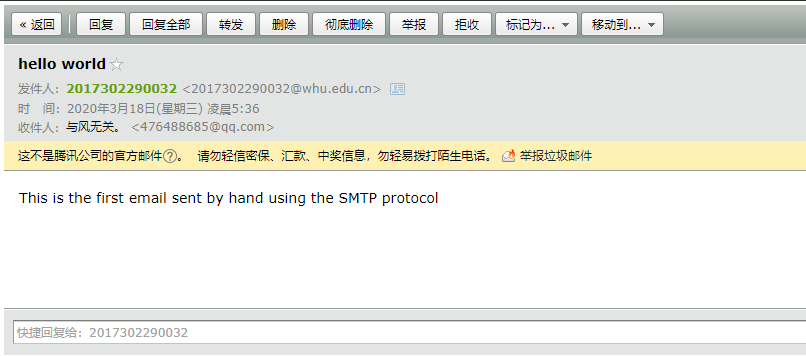
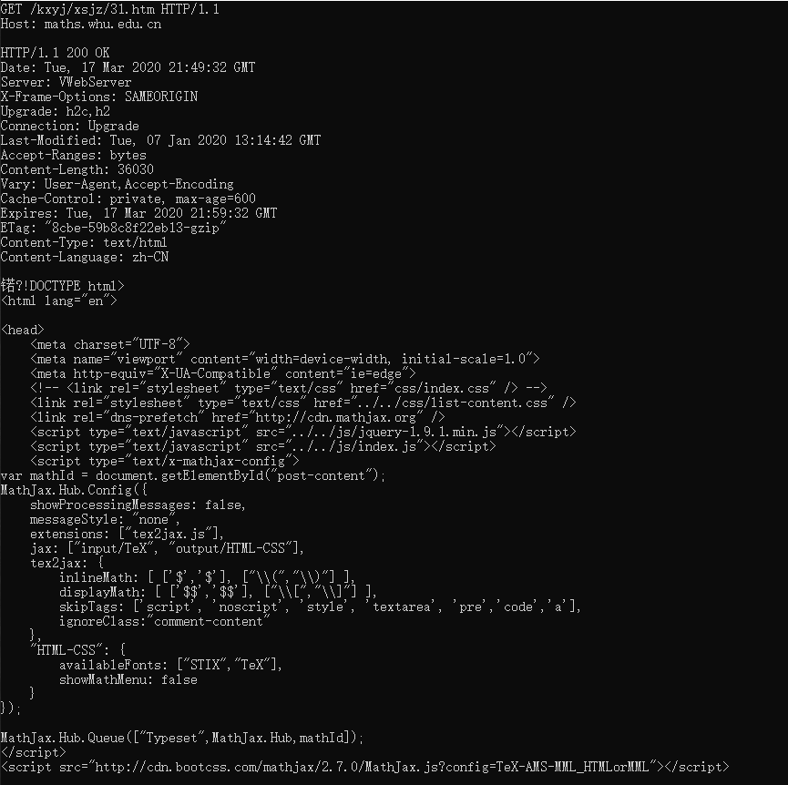
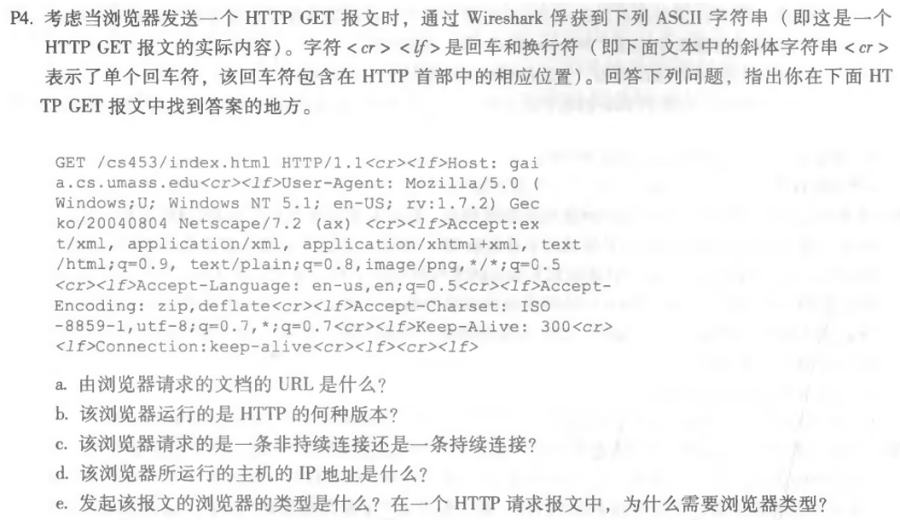
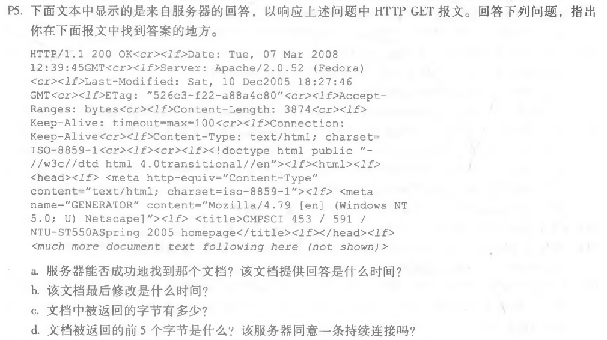

### 第三次作业

* * *

### telnet whu.edu.cn 25

> 根据PPT中所提供的教程博客，进行SMTP 交互实验，观察来自服务器的 220 应答 
，并输入命令使无需通过邮件客户端即可发送邮件。

* 和SMTP服务器建立连接，`telnet whu.edu.cn 25`。

* ehlo 发件人用户名，`helo ly`。

* 选择登录认证方式login，即输入命令 `auth login`。
  
* 分别输入经过Base64加密后的用户名和密码。

* 指明邮件的发送人和收件人：
  
    ```
    mail from:<2017302290032@whu.edu.cn>
    rcpt to:<476488685@qq.com>
    ```

* 输入data命令，然后编写要发送的邮件内容：

    ```
    data
    from:<2017302290032@whu.edu.cn>     ----邮件头发件人地址
    to:<476488685@qq.com>    ----邮件头收件人地址
    subject:hello world    ----邮件头主题
    　    -----空行
    This is the first email sent by hand using the SMTP protocol    ----邮件的具体内容
    ```

* 输入“`.`”表示邮件内容输入完毕。

* 输入`quit`命令断开与邮件服务器的连接。

    

* 查看邮件的接受结果：

    


* * *

### telnet maths.whu.edu.cn 80

> 参考ppt中的例子，使用Telnet来测试HTTP的响应。
> Escape character: ctrl + ]

* Telnet 到目标的 Web 服务器:

    ```
    telnet maths.whu.edu.cn 80
    按下'ctrl'+']'
    按下'enter'
    ```

* 键入 GET HTTP 请求:

    ```
    GET /kxyj/xsjz/31.htm HTTP/1.1
    Host: maths.whu.edu.cn
    按下'enter'，再按下'enter'
    ```

    

* * *

#### P4

##### 题目：


##### 作答：
a.浏览器请求的文档的URL是 `http://gaia.cs.umass.edu/cs453/index.html`

b.浏览器正在运行`HTTP1.1`版本。

c.浏览器请求的是一条持续连接，由`Connection: keep-alive`可以看出

d.仅看上面的HTTP报文无法得出该浏览器所运行的主机的IP地址。

e.浏览器类型是`Mozilla/5.0`。服务器需要浏览器类型信息将同一对象的不同版本发送到不同类型的浏览器。

* * *

#### P5

##### 题目：


##### 作答：
a.状态代码和短语`200 OK`表示服务器能够找到文档成功。答复的时间是`Tue, 07 Mar 2008 12:39:45 GMT`，由`Date: `项可以看出。

b.最后修改时间是`Sat, 10 Dec 2005 18:27:46 GMT`，由`Last-Modified: `项可以看出。

c.文档中被返回的字节有3874个字节，由`Content-Length: 3874`可以看出

d.返回的前五个字节是：`<!doc`。是持久连接，由`Connection: Keep-Alive`可以看出

* * *


