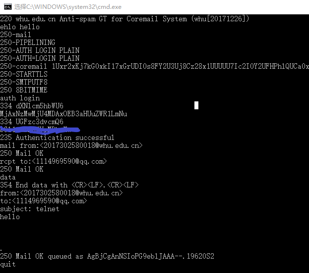
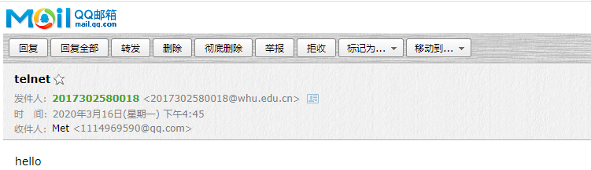
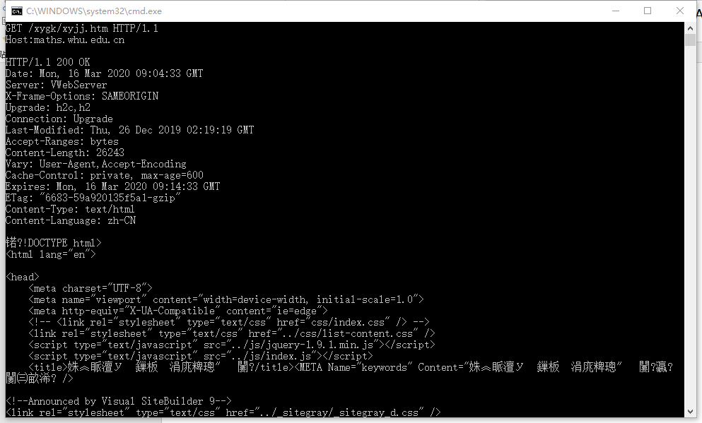
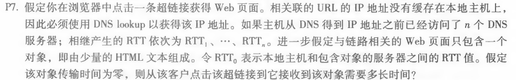
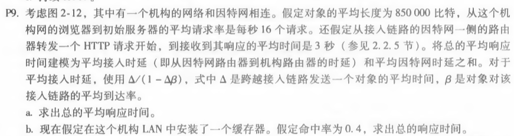

# 网络及分布式计算第三次作业

#### 2017302580018  刘佳媚

---

### 1、telnet whu.edu.cn 25

先与武大官网的25端口进行连接，然后进行相关交互，最终发送邮件。

交互步骤如下：

```
telnet whu.edu.cn 25
ehlo hello
auth login
MjAxNzMwMjU4MDAxOEB3aHUuZWR1LmNu
base64加密密码
mail from:<2017302580018@whu.edu.cn>
rcpt to:<1114969590@qq.com>
data
from:<2017302580018@whu.edu.cn>
to:<1114969590@qq.com>
subject: telnet
hello
.
quit
```

交互过程：



交互结果：




------

### 2、telnet maths.whu.edu.cn 80

先与数院官网80端口进行连接，然后发送GET请求。

交互步骤如下：

```
telnet maths.whu.edu.cn 80
按住ctrl+]后enter
GET /xygk/xyjj.htm HTTP/1.1
Host:maths.whu.edu.cn
```

交互结果如下：




------

### 3、P7

##### 

解：
得到IP地址的时间：T1 = RTT1 + RTT2 + … + RTTn ；

响应时间：T2 = 2 * RTT0 ；

总时间：T = T1 + T2 = 2RTT0 + RTT1 + … + RTTn ；


------

### 4、P9

##### 

解：

a.

平均因特网时延：T1 = 3s

Δ = 850000b / 15Mbps = 0.0567s

β = 16请求/s

平均接入时延：T2 = Δ/（1-Δ * β） = 0.61s

平均响应时延：T = T1 + T2 = 3.61s

b.

因为cache命中率为0.4，所以40%的请求cache可以满足，60%的请求由源服务器满足。

命中缓存时：T1 = 850000b / 100Mbps = 0.0085s

未命中缓存时：

平均因特网时延：T2 = 3s

      β1 = β * 0.6 = 9.6请求/s
      
      平均接入时延：T3 = Δ/（1-Δ * β1） = 0.12s
      
总响应时间：T = 0.4 * T1 + 0.6 * （T2 + T3） = 1.88s


