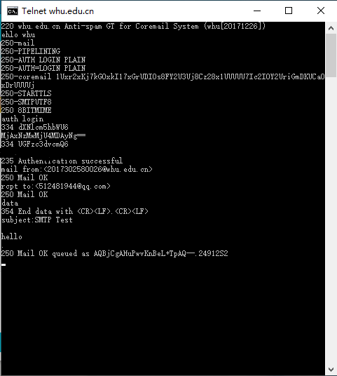
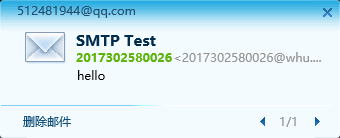
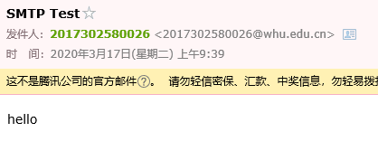
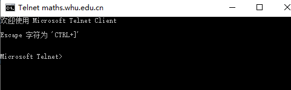
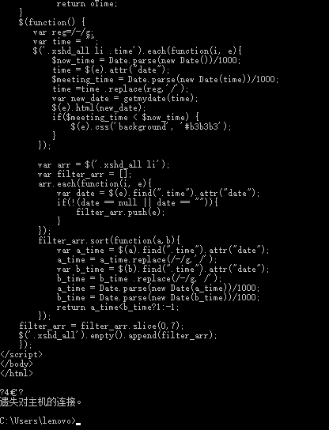

# 网络及分布式计算-Homework3

2017302580026 郑慧                          2020年3月17日

**1. telnet whu.edu.cn 25**

25端口为SMTP服务器开放，故本题可以利用telnet命令发送邮件。具体的实验步骤如下：

* 在命令行中输入telnet whu.edu.cn 25后回车，弹出telnet客户端界面，显示220 whu.edu.cn Anti-spam GT for Coremail System (whu[20171226])说明连接成功；
* 输入ehlo whu开始通信；
* 通过ehlo whu返回的列表可知，武大邮箱服务器支持LOGIN PLAIN两种验证方式，我通过login方式进行验证，输入auth login；
* 输入经过base64加密的用户名和密码；
* 编写邮件，通过mail form:<> 和 rcpt to:<>命令表明发送邮箱和收件邮箱，输入data命令，邮件标题、邮件正文；
* 输入结束符号"."，表明邮件结束，系统返回250 Mail OK……至此邮件发送成功。

实验截图如下：

* 命令行交互截图（密码已抹去）

* 邮件截图

**2. telnet maths.whu.edu.cn 80**

利用武汉大学数学学院的80端口，对HTTP协议进行实验，模拟Get方法，具体步骤如下：

* 在命令行中输入telnet maths.whu.edu.cn 80后回车，进入Telnet客户端界面；

* 通过“Ctrl“ + ”]”，再回车调整到输入模式；

* 通过数学学院官网可知首页网址为：maths.whu.edu.cn/index.htm，故输入

  GET /index.htm HTTP/1.1
  Host: maths.whu.edu.cn

* 连续点击两次enter键
* 得到响应返回

实验截图如下：

* 调整为输入模式

  

* 获得GET结果（由于返回结果过长，仅展示后面部分）

  

  

**3. 第二章习题两道**

*P7.*

由采用非持续连接的HTTP可知

t总 = 2 * RTT0 + t传

t传 = RTT1 + RTT2 + …… +RTTn

故总时间为 2 * RTT0 +  RTT1 + RTT2 + …… +RTTn

*P9.*

（*a.*） t接 = Δ/1-Δβ

Δ = 850000b/15Mbps = 0.057

β = 16

t接 = 0.65s

t总 = t接 + t延 = 3.65s

（*b.*） 由题意知，命中率为0.4

由初始路由器满足的β‘ = 16 * 0.6 = 9.6

t’接 = 0.13s

t缓 =  850000bit / 100Mbps = 0.0085s

t总 = 0.4 * t缓 + 0.6 * ( t‘接 + t延) = 1.8814s

