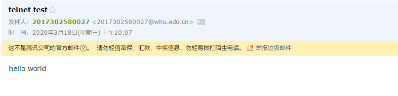
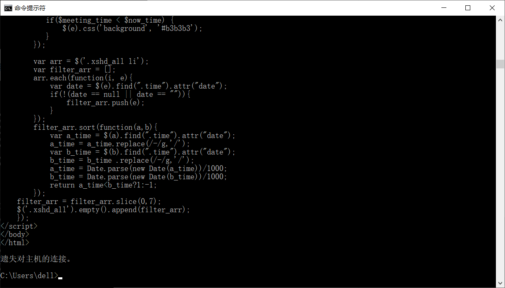

1. # 网络及分布式计算第三次作业

   计算机学院-刁可 -2017302580031

   1. telnet whu.edu.cn 25

      由于我本人（2017302580031-刁可）的武大邮箱由于密码错误次数过多被锁了

      

      所以我借了同学（2017302580027-艾家欣)的武大邮箱进行测试，所以下述过程出现的武大邮箱属于我同学（2017302580027-艾家欣），而并非我（2017302580031-刁可）。

      与武大的25端口进行连接，进行相关交互，不通过客户端就可以发送邮件。

      键入 telnet whu.edu.cn 25

      键入 ehlo whu

      键入 auth login

      输入base64加密的用户名和密码

      编写邮件发送邮箱和收件邮箱，键入data命令，编辑邮件标题、邮件正文

      输入.结束邮件编辑，邮件发送成功

      结果如下：

      

      

   2. telnet maths.whu.edu.cn 80

      与武大数院官网80端口进行连接，然后发送GET请求。

      键入 telnet maths.whu.edu.cn 80

      键入 ctrl+]  ，然后回车，切换成输入模式

      GET /index.htm HTTP/1.1 

      Host: maths.whu.edu.cn

      键入enter

      结果如下：

      

      

   3. P7

      得到IP地址的时间 = RTT1 + RTT2 + … + RTTn

      知道IP地址后，RTT0的时间设置TCP连接和另一个RTT0的时间请求并接收小对象。

      响应时间 = 2 RTT0

      因此总共是得到IP地址的时间加上响应时间

      2 RTT0 + RTT1 + RTT2 + … + RTTn

   4. P10

      考虑10米短链路，忽略其传播的时延。

      带有并行连接的非持续连接且并行下载所用时间
      (200b / 150bps) * 3 + ((10^5)b/ 150bps) + (200b / (150bps / 10)) * 3 + ((10^5)b / (150bps / 10)) = 7377.3s

      持续连接所用时间
      (200b / 150bps) * 3 + ((10^5)b / 150bps) + 10 * (200b/150bps + (10^5)b/150bps) = 7351s
      两种所用时间相差很小，几乎可以看作没有，因此是没有很大增益的。