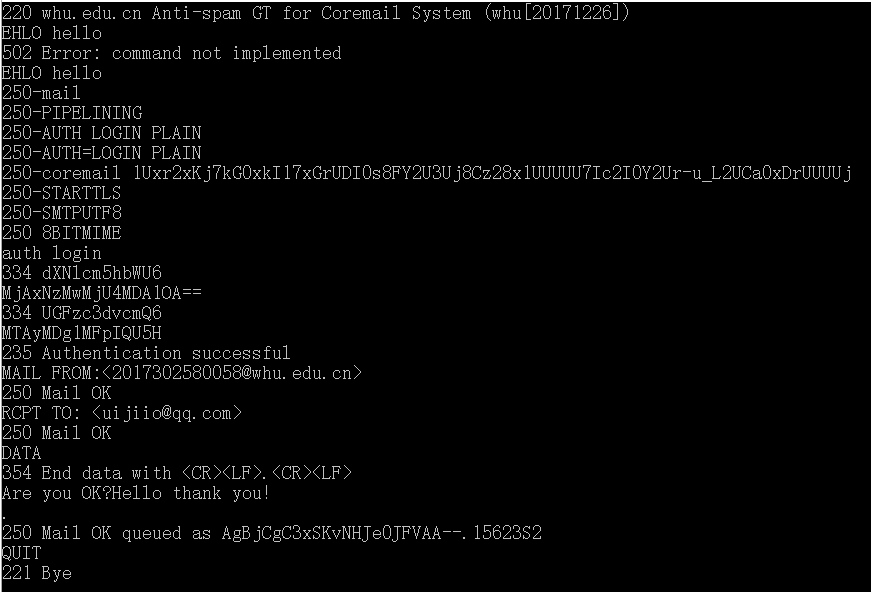
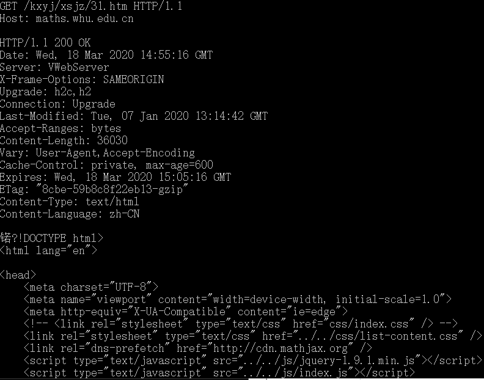

### 书本习题：

##### p4  答：

a)由浏览器请求的文档的URL是：[gaia.cs.umass.edu/cs453/index.html](http://gaia.cs.umass.edu/cs453/index.html)

b)是1.1版本

c)持续连接

d)报文中没有IP地址

e)浏览器类型是Mozilla/5.0；需要类型是因为可以针对不同的浏览器发送不同版本的网页

##### p7  答：

得到IP地址的时间 = RTT1 + RTT2 + … + RTTn
三次握手加上最后的响应 = 2 RTT0
因此总共是 2 RTT0 + RTT1 + RTT2 + … + RTTn

### SMTP邮件：

##### 按照如下顺序输入命令：

telnet whu.edu.cn 25
EHLO hello	
auth login	
MjAxNzMwMjU4MDA1OA==
MTAyMDg1MFpIQU5H
MAIL FROM:<2017302580058@whu.edu.cn>
RCPT TO: <uijiio@qq.com>
DATA
Are you OK?Hello thank you!
.
QUIT	

##### 截图如下：

##### 

### 数学院GET请求：

##### 按顺序进行如下操作：

输入  telnet maths.whu.edu.cn 80

按  ctrl+]

按  Enter

输入  GET /kxyj/xsjz/31.htm HTTP/1.1

输入  Host: maths.whu.edu.cn

按  Enter、Enter

##### 截图如下：

