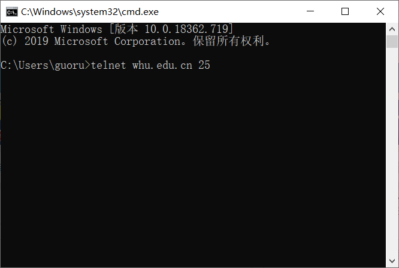
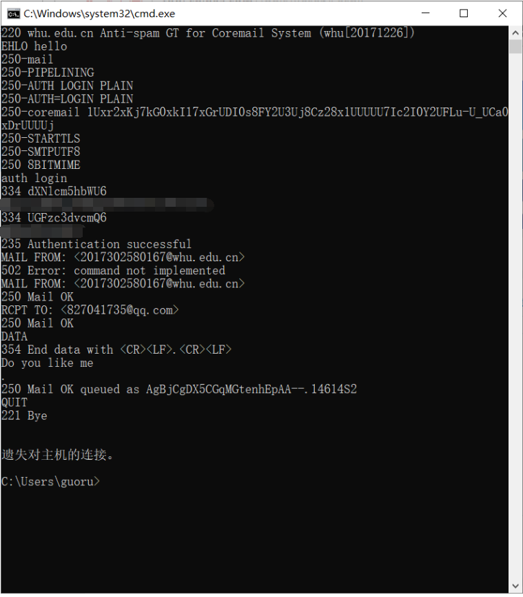
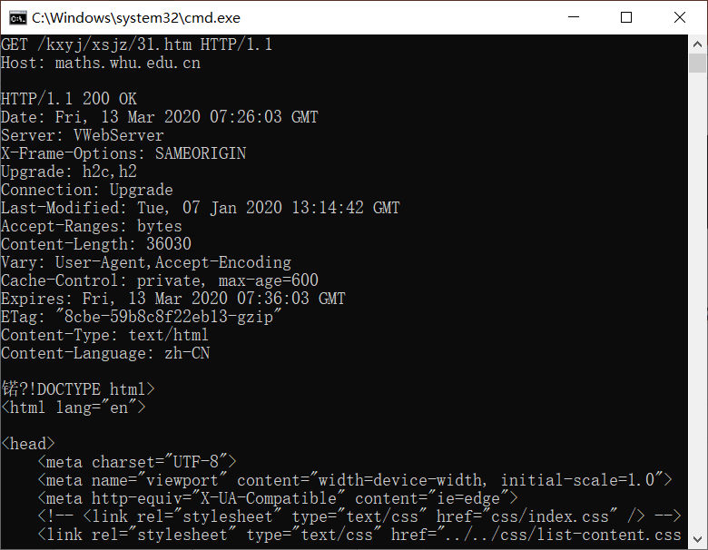
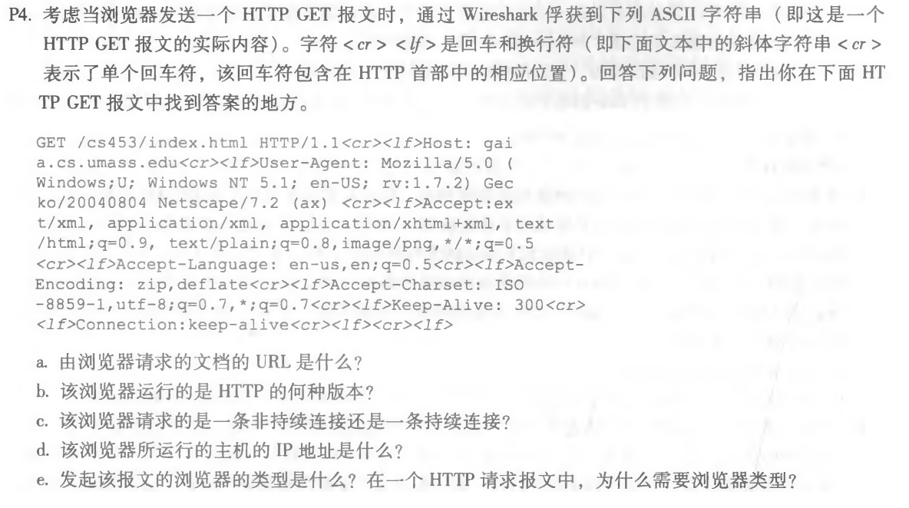

## 第三次作业


### 1. 与武大官网端口25进行smtp交互

1. telnet whu.edu.cn 25

   

2. 输入smtp交互命令

   ```
   telnet whu.edu.cn 25
   EHLO hello
   auth login
   用户名base64
   密  码base64
   MAIL FROM: <2017302580167@whu.edu.cn>
   RCPT TO: <827041735@qq.com>
   DATA
   Do you like me
   .
   QUIT
   ```

   


### 2. 向数学网站发送GET请求

1. 连接数学网站80端口

   ```
   telnet maths.whu.edu.cn 80
   ```

2. 发送GET请求

   ```
   1. ctrl+]
   2. enter
   3. 粘贴:GET /kxyj/xsjz/31.htm HTTP/1.1
   Host: maths.whu.edu.cn
   4. enter, enter
   ```

   


### 3. 课本习题

1. p4

   

```
a. http://gaia.cs.umas.edu/cs453/index.html
b. 1.1版本
c. Connection:keep-alive表明这是一个持续连接
d. 这里无法看出主机的IP地址
e. Mozilla/5.0。服务器需要将对象的不同版本发到对应的浏览器
```


2. p9


```
a. 一个对象的平均时间 ▲ = 850000 / 15Mbps = 0.054(s)
	平均到达率β = 16
	t = 3 + ▲/(1-▲β) = 3 + 0.39 = 3.39s

b.  t = 0.6*(3.39) + 0.4*cache = 2.034(s)
```

