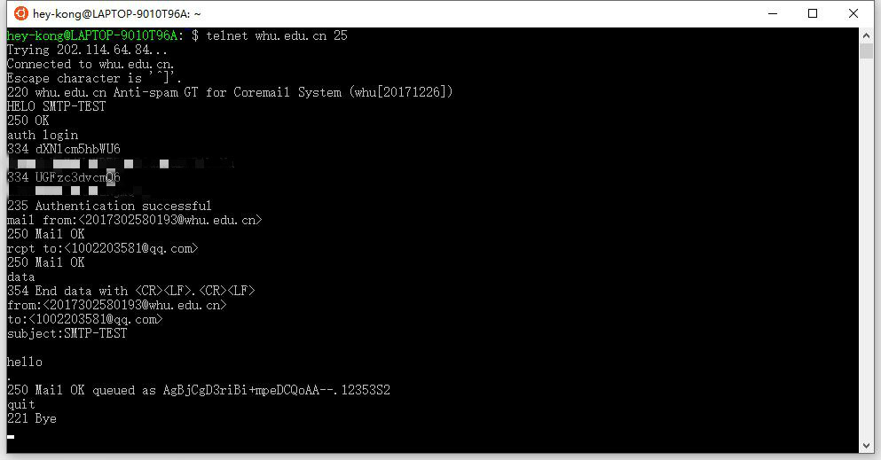
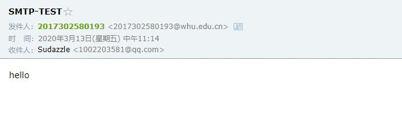
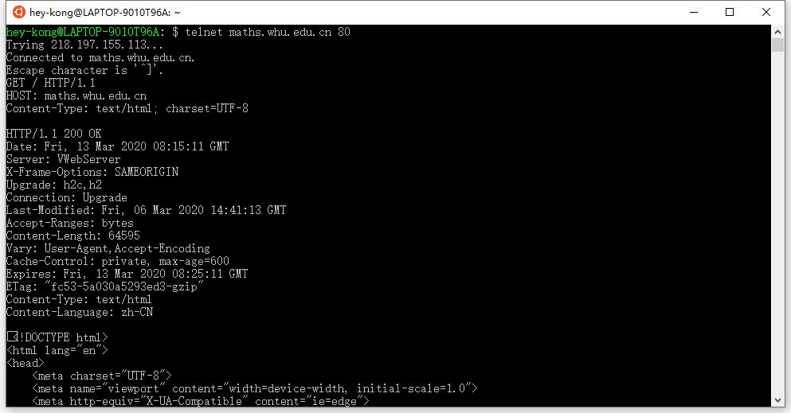

## 分布式与网络课程作业三

### telnet whu.edu.cn 25:
通过 `telnet` 使用 `stmp` 协议，用武大邮箱发送邮件：



QQ 邮箱成功接收到了邮件：




### telnet maths.whu.edu.cn 80:
通过 `telnet` 模拟 HTTP 的 `GET` 请求：



其中 `GET` 请求为：
```
GET / HTTP/1.1
HOST: maths.whu.edu.cn
Content-Type: text/html; charset=UTF-8
```
`maths.whu.edu.cn` 服务器成功返回了页面的内容。


### P4:
a. URL 是 http://gaia.cs.umass.edu/cs453/index.html 。`Host` 字段表示服务器的地址，`/cs453/index.html` 表示文件路径。

b. 浏览器正在运行 HTTP1.1 版本，从请求行可以看出。

c. 持续连接，从 `Connection:keep-alive` 可以看出。

d. 从 HTTP 报文中无法知道主机的IP地址，IP 地址需要在 IP 数据包中查看。

e. Mozilla/5.0，从 `User-Agent` 字段可以看出。服务器需要浏览器类型信息，从而将同一对象的不同版本发送到不同类型的浏览器，因此需要浏览器类型。


### P5:
a. 能，因为返回状态码 `200 OK`。 

b. 最后修改时间是在 2005 年 12 月 10 日星期六 18:27:46（格林尼治时间），从 `Last-Modified` 字段可以看出。

c. 返回 3874 个字节，从 `Content-Length` 字段可以看出。 

d. 返回的前 5 个字节是 `<!doc` 。服务器同意一条持续链接，因为 `Connection: Keep-Alive`。
