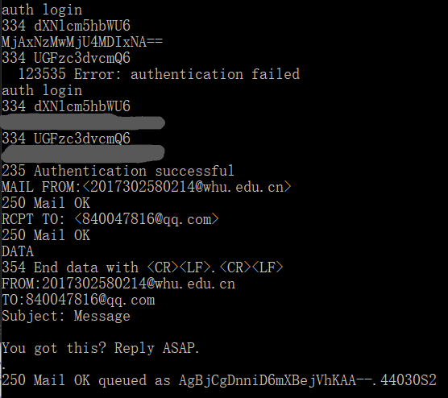
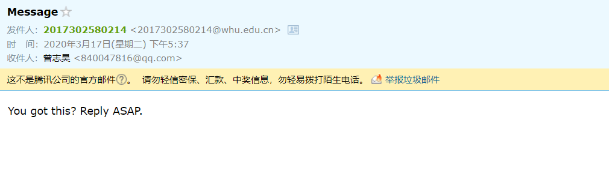
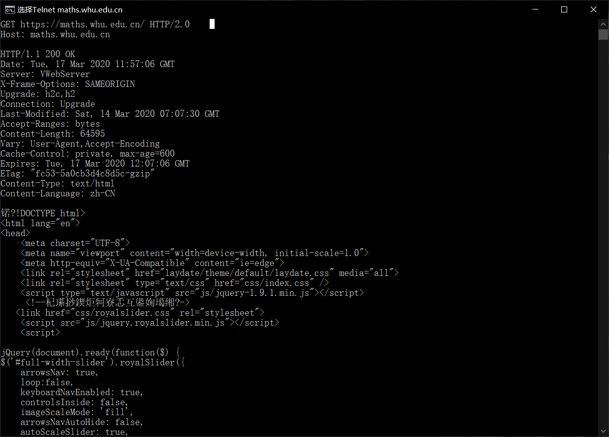

# 第三次作业

曾志昊 2017302580214

-----

## 课后作业

* p9
  a. 求出总的平均响应时间。

  ``` 
  850000b /15Mbps = 0.0567s
  每秒平均16个请求 => β = 16
  总平均接入时间 = 3 + 平均接入时延 = 3 + 0.0567/(1-16*0.0567) = 3.611s
  ```

  b. 现在假定在这个机构LAN中安装了一个缓存器。假定命中率为0.4,求出总的响应时间。

  ``` 
  0.6*16 = 9.6
  所以平均每秒9.6个请求未被命中
  此时平均接入时延为0.567/（1-0.567*9.6） = 0.126s
  总的平均响应时间为0.4*t + 0.6 *(3+0.126)
  	其中t忽略不计 最终结果为3.648s
  ```

  

* p10

  ``` 
  由于带宽均匀分配，所以总时间等于10乘上一个下载独占链路的时间
  
  采用非持续http的并行下载：
  	每次下载都需要共三次控制分组传输
  	
  	独占时间 = 3 * 控制分组时间 + 数据分组时间
  		    = 3 * (200b/150bps) + (100000b/150)
  		    = 670.66s
  	总时间   = 10 * 独占时间
  		    = 6706.6s
  
  采用持续http并行下载：
  	每次下载只需要依次控制分组传输
  	独占时间 = 控制分组时间 + 数据分组时间
  		    = (200b/150bps) + (100000b/150)
  		    = 668s
  	总时间   = 10 * 独占时间
  		    = 6680s
  
  实际上持续方法只是在每次下载时减少了两次控制分组传输的时间，十次下载总共比非持续方法节约了20s的时间，相较于总下载时间，其实并没有太大的优势。
  	
  ```

  


## telnet whu.edu.cn 25

- **输入的命令如下**

  

  ``` 
  EHLO haha
  auth login
  **************(加密账号)
  **************(加密密码)
  MAIL FROM:<2017302580214@whu.edu.cn>
  RCPT TO: <840047816@qq.com>
  DATA
  FROM:2017302580214@whu.edu.cn
  TO:840047816@qq.com
  Subject: Message
  
  You got this? Reply ASAP.
  .
  
  
  ```

  

  **遇到的问题如下：**

  * 账号和密码，一开始尝试的时候直接输入邮箱和密码，会出现 **535 Error: authentication failed**的情况，查资料后才知道需要对账号和密码进行加base64加密

  * 登录时的账号也经过多次尝试，输入邮箱地址也出现535错误，而输入学号过后成功登录
  * 邮件内容的问题，成功发送多次邮件，但是接收到的都是空标题和空内容的邮件，后来多次尝试，才发现，需要在subject后空一行再输入内容才能成功。
  * 在输入命令时不能输入错误后删除，否则会出现command not inplemented 或者 bad syntex 等问题。

  **结果展示**

  >
  >
  >
  >
  >
  >
  >


## telnet  maths.whu.edu.cn 80

* 输入 telnet maths.whu.edu.cn 80

* 然后 ctrl+]  + enter

* 复制

  GET https://maths.whu.edu.cn/ HTTP/2.0                                                                                  Host: maths.whu.edu.cn 

  两次 enter

* 结果如下：




