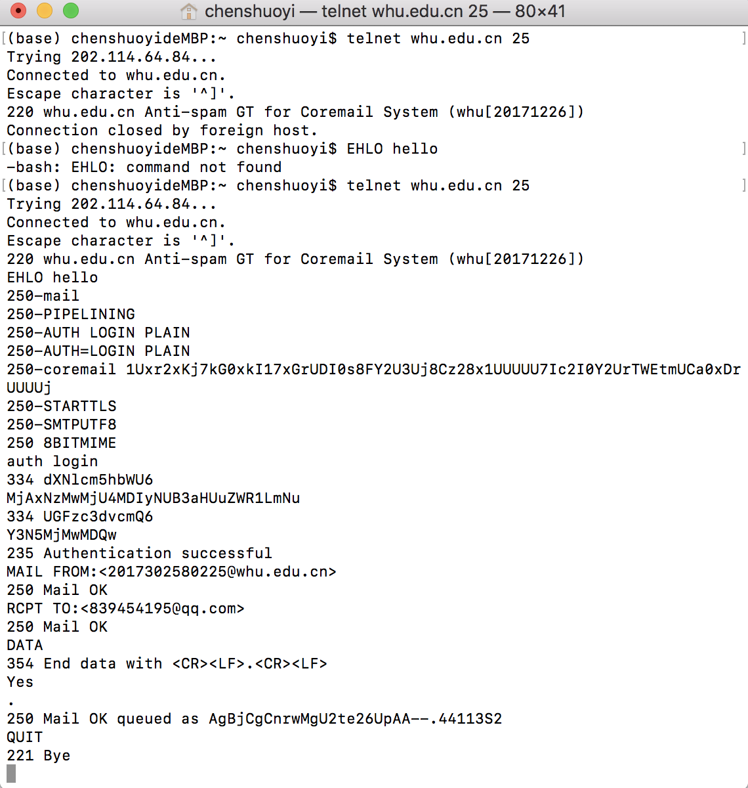
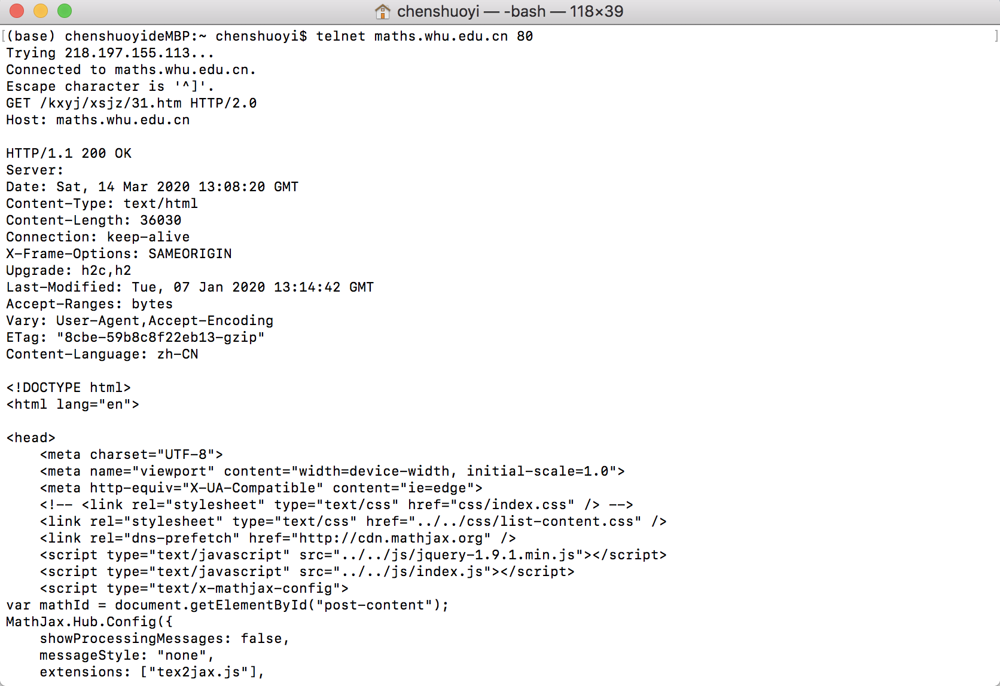
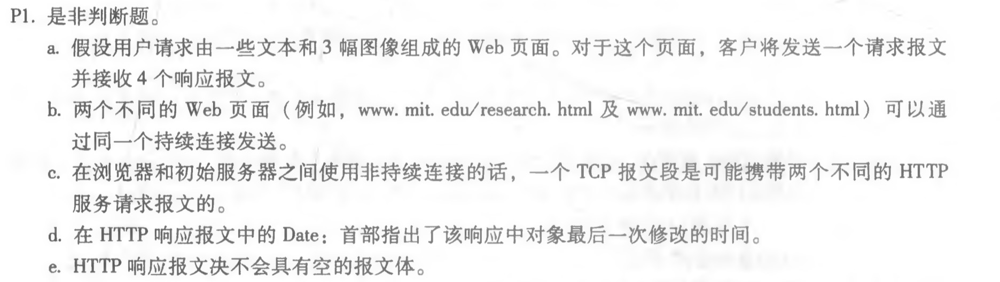
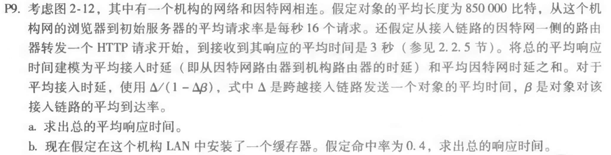

## telnet whu.edu.cn 25

```
telnet whu.edu.cn 25
EHLO hello
auth login
用户名MjAxNzMwMjU4MDIyNUB3aHUuZWR1LmNu(2017302580225@whu.edu.cn)
密码Y3N5MjMwMDQx
MAIL FROM:<2017302580225@whu.edu.cn>
RCPT TO:<839454195@qq.com>
DATA
Yes
.
QUIT
```



## telnet maths.whu.edu.cn 80

```
telnet maths.whu.edu.cn 80
GET /kxyj/xsjz/31.htm HTTP/2.0
Host: maths.whu.edu.cn
```



## 第二章习题



```
a.
错 客户将发送4个请求
b.
对
c.
错 非持续连接最多发送一个对象
d.
错 Date表示是服务器是在什么时候响应回浏览器
e.
错
```



```
a.
发送一个对象的平均时间 = 850000bit/15Mbps = 0.054s

平均接入时延 = 0.054/(1-0.054*16) = 0.4s

总的平均响应时间 = 0.4 + 3 = 3.4s

b.
0.6*源服务器产生的时延 + 0.4*cache满足的服务产生的时延 ≈ 2.04s
 
```

