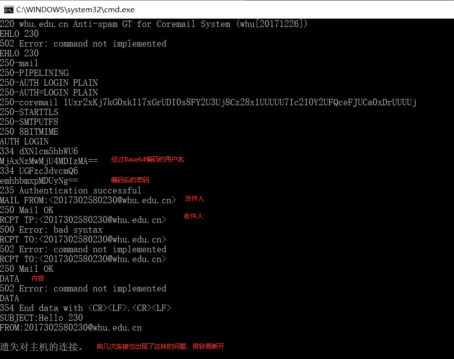
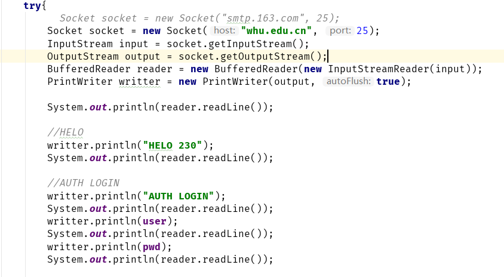
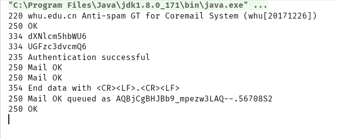
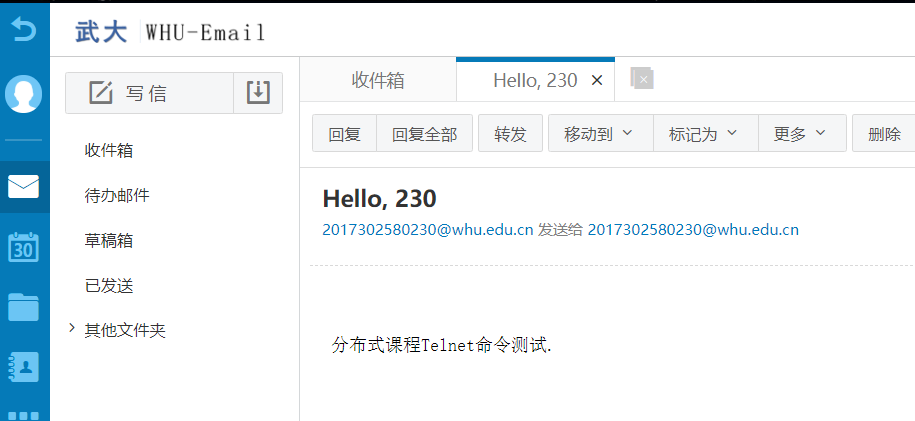
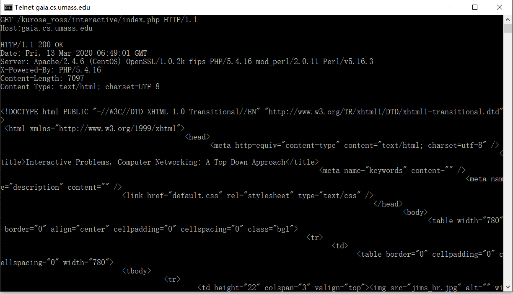
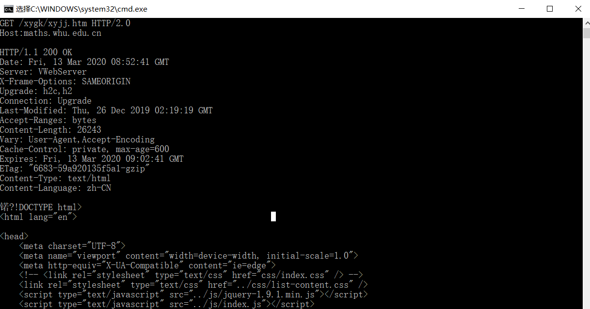
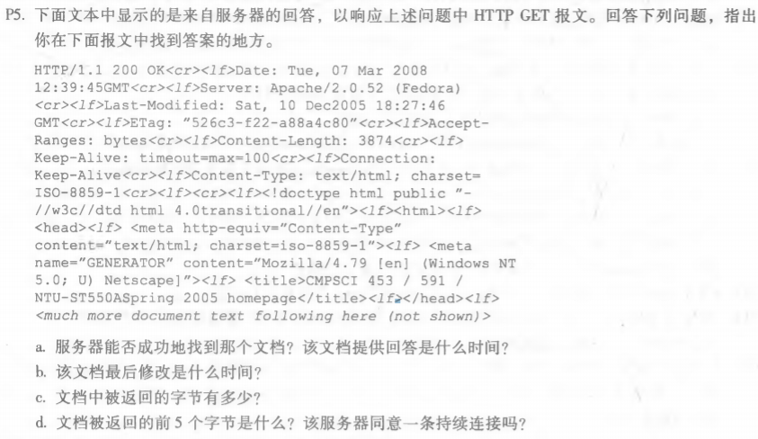
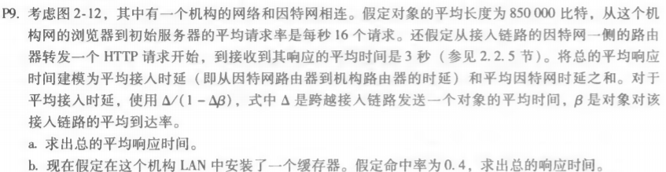

<h1>Homework3</h1>

## 1. telnet whu.edu.cn 25

通过telnet whu.edu.cn 25命令连接到武汉大学SMTP服务器后，进行了EHLO、AUTH LOGIN、MAIL FROM、RCPT TO、DATA等命令的测试。但在测试过程中，发现了一些存在的问题，比如同一条命令有可能会执行失败，如：EHLO 230，第一次执行时返回了502 Error，但第二次执行时成功了。另一个很大的问题是本机与SMTP服务器建立的连接很不稳定，很容易遗失对主机的连接，因此后序的命令并未执行。

1.1 telnet命令

既然控制台连接可能出现由于输入速度过慢导致连接中断的问题，于是利用Java，基于Socket实现SMTP协议进行尝试。邮箱名称和密码的编码利用到了sun.misc.BASE64Decoder.jar包，最终顺利发送邮件。

1.2 部分java代码

1.3 执行结果

1.4 武大邮箱接收信件

## 2. telnet maths.whu.edu.cn 80

PPT上例子，即：gaia.cs.umass.edu与maths.whu.edu.cn，均能成功返回网页源码.

2.1 gaia.cs.umass.edu

2.2 maths.whu.edu.cn

## 3. chapter2 p5

### a.

由HTTP GET报文中的200 OK可知，服务器成功地找到了文档。该文档提供回答的时间是：Tue, 07 Mar 2008 12:39:45GMT.

### b.

该文档最后的修改时间是：Sat, 10 Dec2005 18:27:46.

### c.

该文档返回的字节数是：3874.

### d.

该文档返回的前五个字节是：<!doc；由报文中Connection:Keep-Alive字段可知，服务器同意一条持续连接。

## 4. chapter2 p9

### a.

由图2-12可知，链路为15Mbps。
接入链路发送一个对象的平均时间为：850000 / 15000000 = 0.0567 sec；接入链路上的流量强度为：16 * 850000 / 15000000 = 0.907，因此平均接入时延为：0.0567 / （1 - 0.907）= 0.610 sec。
所以总的平均响应时间为：0.610 + 3 = 3.610 sec.

### b.

安装缓存器后命中率为0.4，所以链路流量减少了40%，此时平均接入时延为：0.0567/（1-0.6*0.907）= 0.124 sec。如果请求由缓存器满足的话，其响应时间近似为0；当缓存器未被命中时，平均响应时间为：0.124 + 3 = 3.124 sec。
因此，总的平均响应时间为：0.4 * 0 + 0.6 * 3.124 = 1.874 sec.