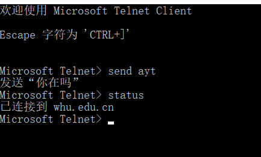
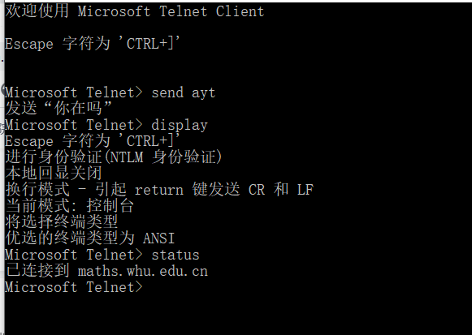
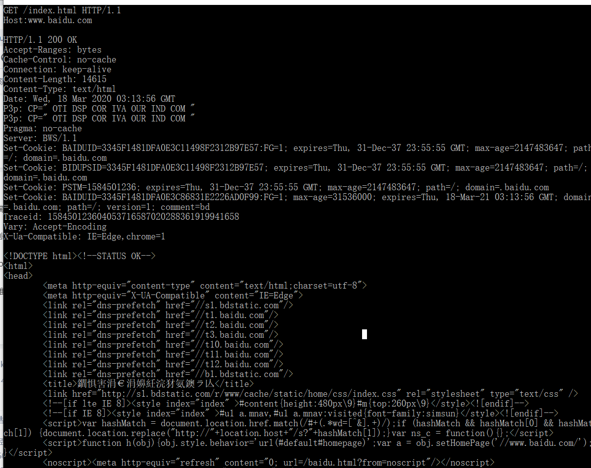

telnet whu.edu.cn 25

telnet maths.whu.edu.cn 80

telnet模拟HTTP请求，采用百度网址进行实验

 

习题P5

a.

能找到文档

提供时间为Tue, 07 Mar 2008 12:39:45 GMT

b.

最后修改时间为Last-Modified: Sat, 10 Dec 2005 18:27:46 GMT

c.

根据Content-Length: 3874可得

d.

前五个字节："<!doc"

根据 keep-alive 看出同意持续连接

 

习题P15

MTA(Mail Transfer Agents) 其实就是提供邮件传输服务的 SMTP 服务器和客户端。 

当消息转发到 Internet 环境或从 Internet 环境转发消息时，网关必须预先添加 Received 行，而且并且Received行不得更改，所以最后的Received 行所指示的地址就是源地址，即 58.88.21.177

 

 