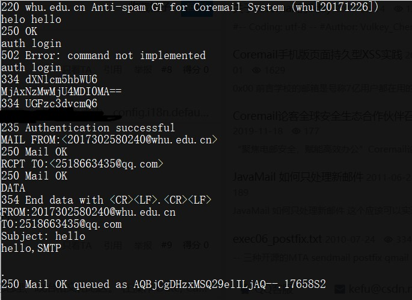
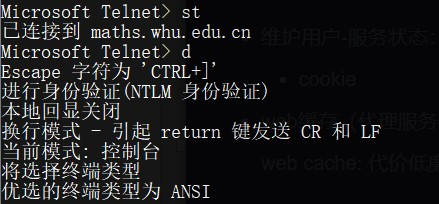
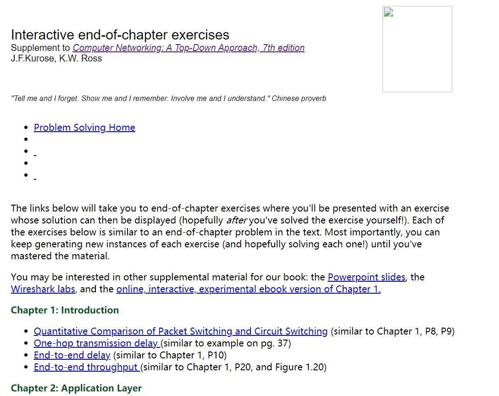
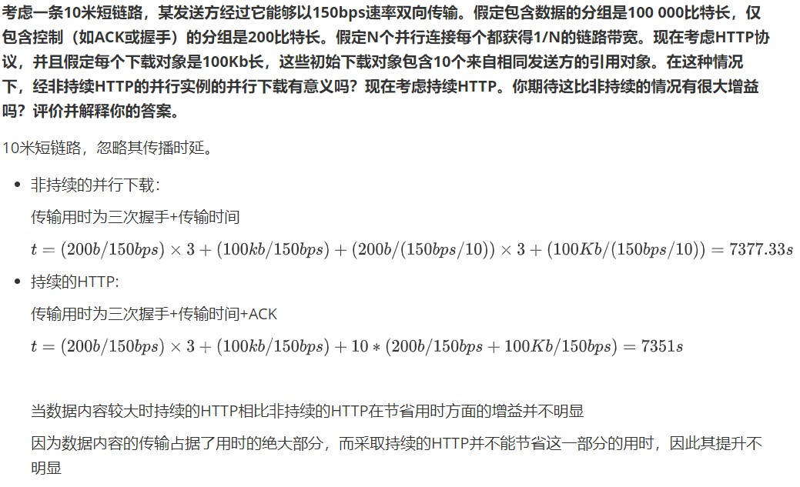
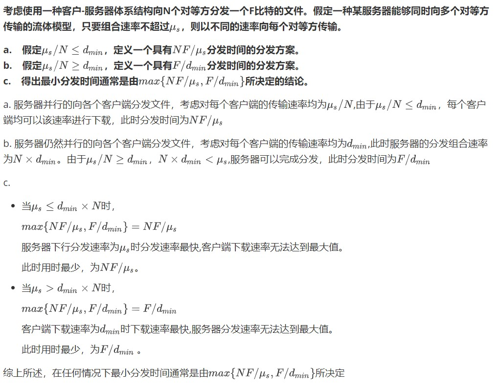

# 网络及分布式计算作业（三）

[toc]

## Telnet测试

### whu.edu.cn:25

+ 交互模式

+ 命令模式

### maths.whu.edu.cn:80

+ 命令模式

  

+ 交互模式 

  + 使用HTTP GET方法请求首页：

    

    由于编码原因控制台输出的网页代码包含乱码。

+ 使用postman工具执行http请求

  

拷贝返回结果使用浏览器打开

​	

### gaia.cs.umass.edu:80

连接教材网站获取相关页面

GET课堂中提到的页面，获取页面后打开结果如下：

## 课后习题-截图

### P10

### P23

## 课后习题-原文

### P10

**考虑一条10米短链路，某发送方经过它能够以150bps速率双向传输。假定包含数据的分组是100 000比特长，仅包含控制（如ACK或握手）的分组是200比特长。假定N个并行连接每个都获得1/N的链路带宽。现在考虑HTTP协议，并且假定每个下载对象是100Kb长，这些初始下载对象包含10个来自相同发送方的引用对象。在这种情况下，经非持续HTTP的并行实例的并行下载有意义吗？现在考虑持续HTTP。你期待这比非持续的情况有很大增益吗？评价并解释你的答案。**

10米短链路，忽略其传播时延。

+ 非持续的并行下载：

  传输用时为三次握手+传输时间

  $$t=(200b/150bps)\times3 + (100kb/150bps)+(200b / (150bps / 10)) \times3 + (100Kb / (150bps / 10))=7377.33s$$

+ 持续的HTTP:

  传输用时为三次握手+传输时间+ACK

  $$t=(200b/150bps)\times3 + (100kb/150bps)+10*(200b / 150bps+100Kb/150bps)=7351s$$

  

  当数据内容较大时持续的HTTP相比非持续的HTTP在节省用时方面的增益并不明显

  因为数据内容的传输占据了用时的绝大部分，而采取持续的HTTP并不能节省这一部分的用时，因此其提升不明显

### P23

**考虑使用一种客户-服务器体系结构向N个对等方分发一个F比特的文件。假定一种某服务器能够同时向多个对等方传输的流体模型，只要组合速率不超过$\mu_s$，则以不同的速率向每个对等方传输。** 

**a.	假定$\mu_s/N\le d_{min}$，定义一个具有$NF/\mu_s$分发时间的分发方案。**
**b.	假定$\mu_s/N\ge d_{min}$，定义一个具有$F/d_{min}$分发时间的分发方案。**
**c.	得出最小分发时间通常是由$max\{ NF/\mu_s, F/d_{min}\}$所决定的结论。**

a. 服务器并行的向各个客户端分发文件，考虑对每个客户端的传输速率均为$\mu_s/N$,由于$\mu_s/N\le d_{min}$，每个客户端均可以该速率进行下载，此时分发时间为$NF/\mu_s$

b. 服务器仍然并行的向各个客户端分发文件，考虑对每个客户端的传输速率均为$d_{min}$,此时服务器的分发组合速率为$N\times d_{min}$。由于$\mu_s/N\ge d_{min}$，$N\times d_{min}< \mu_s$,服务器可以完成分发，此时分发时间为$F/d_{min}$

c. 

+ 当$\mu_s\le d_{min}\times N$时，

  $max\{ NF/\mu_s, F/d_{min}\}=NF/\mu_s$

  服务器下行分发速率为$\mu_s$时分发速率最快,客户端下载速率无法达到最大值。

  此时用时最少，为$NF/\mu_s$。

+ 当$\mu_s > d_{min}\times N$时，

  $max\{ NF/\mu_s, F/d_{min}\}=F/d_{min}$

  客户端下载速率为$ d_{min}$时下载速率最快,服务器分发速率无法达到最大值。

  此时用时最少，为$F/d_{min}$ 。

综上所述，在任何情况下最小分发时间通常是由$max\{ NF/\mu_s, F/d_{min}\}$所决定