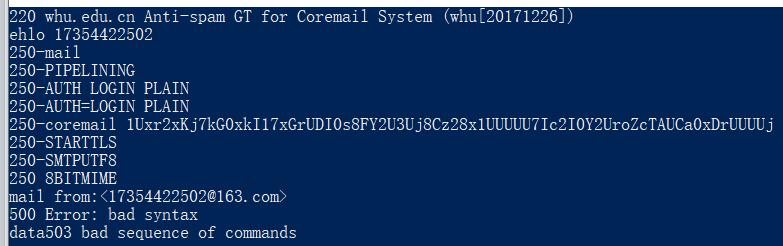
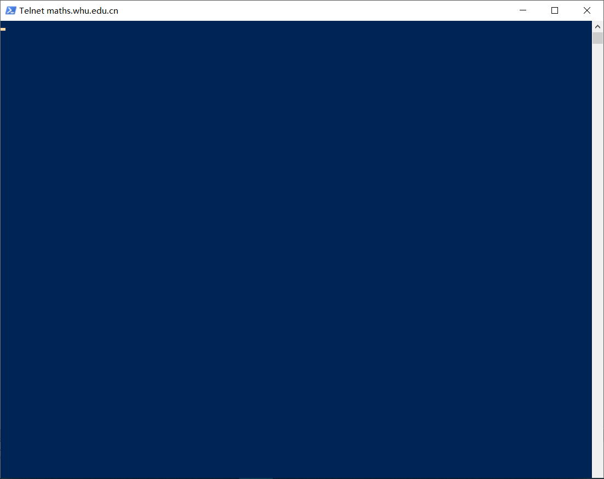
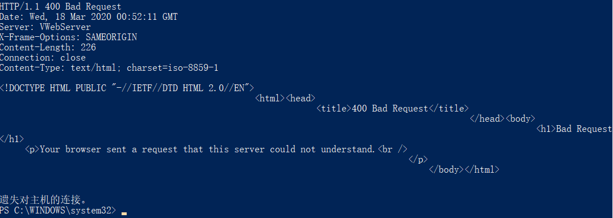

# telnet whu.edu.cn 25

​		进入使用该命令之后，效果如下图所示，在使用mail from rect to 等命令都会出现错误。

# telnet maths.whu.edu.cn 80

​		输入该命令进入如下界面，键盘输入看起来没有反应。

在输入get后回车，就会出现下图的情况，遗失对主机的连接。

 telnet是TCP/IP中的，是internet远程登陆服务的标准协议和主要方式。是常用的远程控制WEB服务器的方法。

# P3

​		在运输层TCP,UDP,在应用层可以用 DNS HTTP.

# P5

​		a:能    Tue,07 Mar 2008 12:39:45 GMT

​        b:Last-Modified: SAT, 10 DEC 2005 18:27:46 GMT

​		c:Content-Length:3874

​		d <!doc     同意 