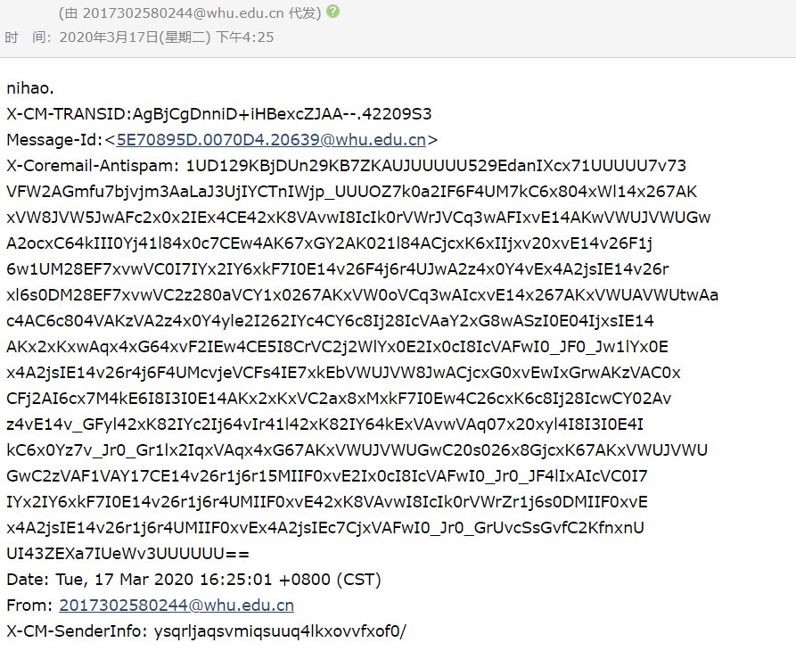
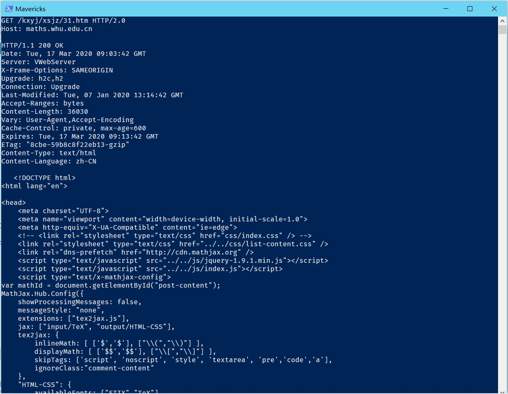
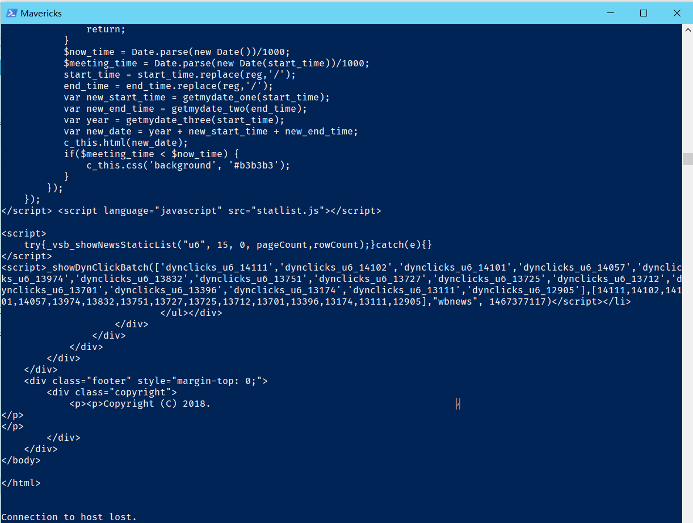
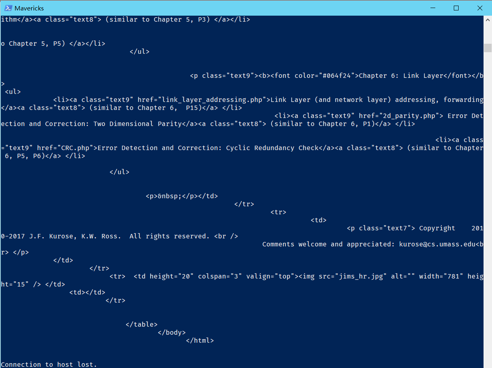

# 网络及分布式 第三次作业

[TOC]

## Telnet

### telnet whu.edu.cn 25

相关操作：

```powershell
$ telnet whu.edu.cn 25
EHLO Hello
auth login
334 dXNlcm5hbWU6
MjAxNzMwMjU4MDI0NEB3aHUuZWR1LmNu(2017302580244@whu.edu.cn的Base64编码)
334 UGFzx3dvcmQ6
(密码的Base64编码)
235 Authentication successful
MAIL FROM: <2017302580244@whu.edu.cn>
250 Mail OK
RCPT TO: <目标邮箱>
250 Mail OK
DATA
354 End data with <CR><LF>.<CR><LF>
您所需要的内容
.			// 结束符
250 Mail OK queued as ---
QUIT
```

效果图：




### telnet maths.whu.edu.cn 80

相关操作：

```powershell
$ telnet maths.whu.edu.cn 80
$ Ctrl+]
$ Enter
GET /kxyj/xsjz/31.htm HTTP/2.0
Host: maths.whu.edu.cn
Enter
Enter
```

效果图：





### telnet gaia.cs.umass.edu 80

相关操作：

```powershell
$ telnet gaia.cs.umass.edu 80
ctrl+]
Enter
GET /kurose_ross/interactive/index.php HTTP/1.1
Host: gaia.cs.umass.edu
Enter
Enter
```

效果图：




## 第二章作业题

### P9

#### a.

由图2-12的题设可知，接入链路的数据传输速度为15Mbps。

因而跨越接入链路发送一个对象的平均时间为：850000比特/15Mbps=0.0567s

接入链路上的流量强度为：(16个请求/s)*(850000比特/请求)/(15Mbps)=0.907

平均接入时延为：0.0567s/(1-0.907)=0.610s

总的平均响应时间为：3s+0.610s=3.610s

#### b.

安装缓存器后，命中率为0.4，所以40%的请求会由缓存器得到回应。

此时平均接入时延为：0.0567s/(1-0.6\*0.907)=0.124s

平均响应时间为：3s+0.124s=3.124s

如果由缓存器满足的话，根据图2-12的题设，时延设置为10ms

因此，总的平均响应时间为：0.4\*(0.01s)+0.6\*3.124s=1.878s

### P10

链路为10米短链路，传输速率Tp=10/(3*10^8)=0.03ms，可以忽略不计。

#### 非持续的HTTP并行下载

所需时间为三次握手+传输时间，并行下载允许10个连接共享150bps速率。

t=(200b/150bps)\*3+(100kb/150bps)+(200b/(150bps/10))\*3+((100000)b/(150bps/10)) = 7377.3s

#### 持续的HTTP下载

t=(200b/150bps)\*3+(100kb/150bps)+10\*(200/150+10000/150)=7351s

因此，持续性HTTP下载的速度相较非持续的HTTP并行下载增益很少。