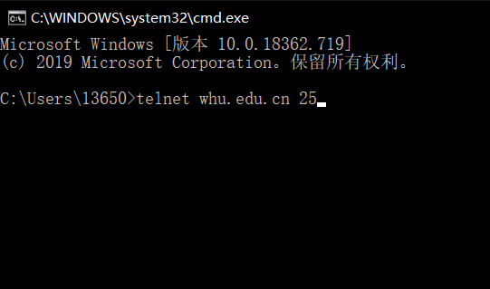
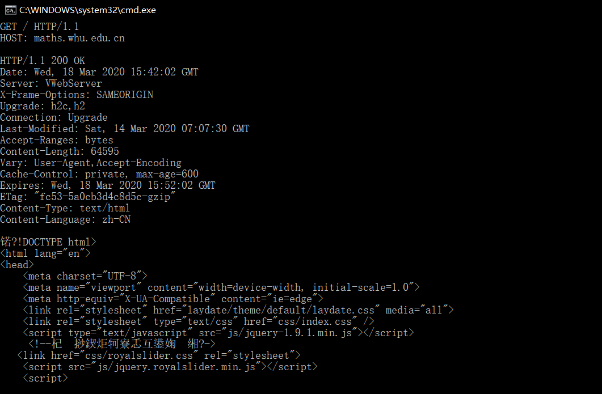

## telnet whu.edu.cn 25

首先在控制面板->程序和功能中打开Telnet Client功能，然后在控制台中键入指令telnet whu.edu.cn 25回车



键入ehlo和自己的学号回车，在输入经过base64加密的武大邮箱账号密码，向自己的QQ邮箱发送了信息


## telnet maths.whu.edu.cn 80

在控制台中键入指令telnet maths.whu.edu.cn 80回车,键入Ctrl+]再回车，再粘贴上请求

```
GET / HTTP/1.1
HOST: maths.whu.edu.cn
```

得到网页回复




## P1

**a.** 错
**b.** 对
**c.** 错
**d.** 错
**e.** 错

## P3

应用层：DNS HTTP
运输层：TCP(HTTP需要) UDP(DNS需要)