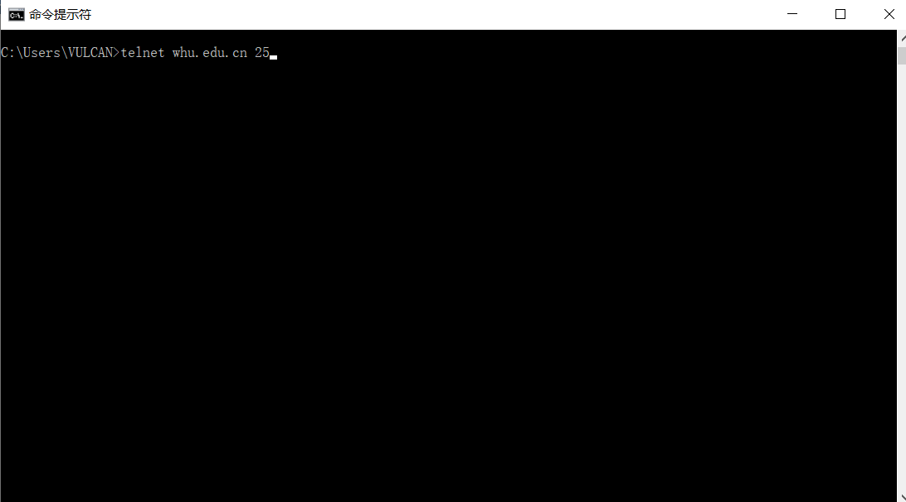
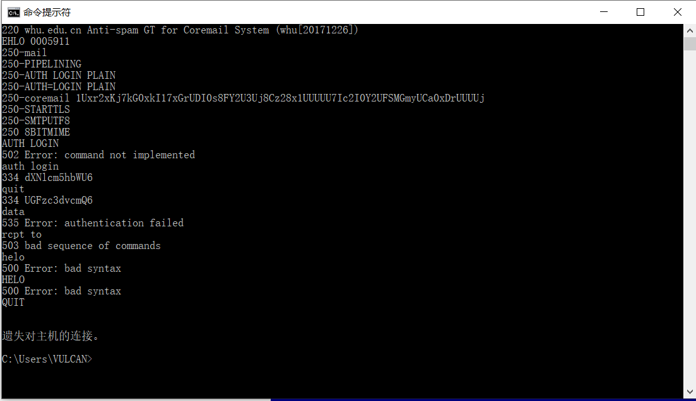
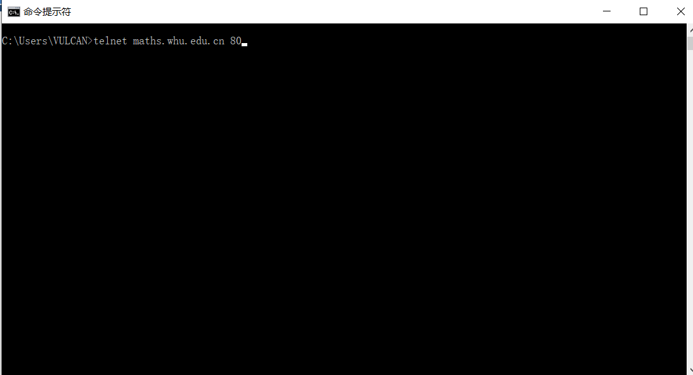
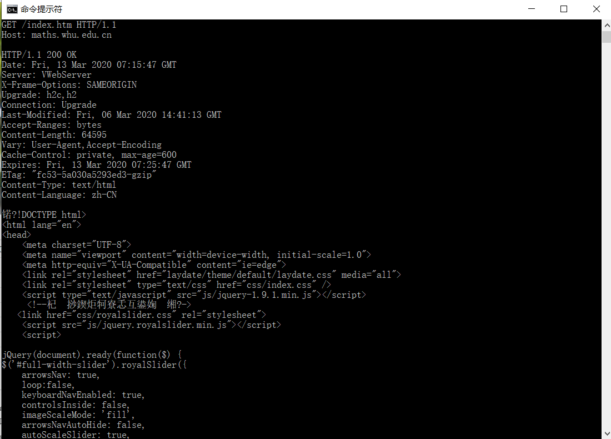
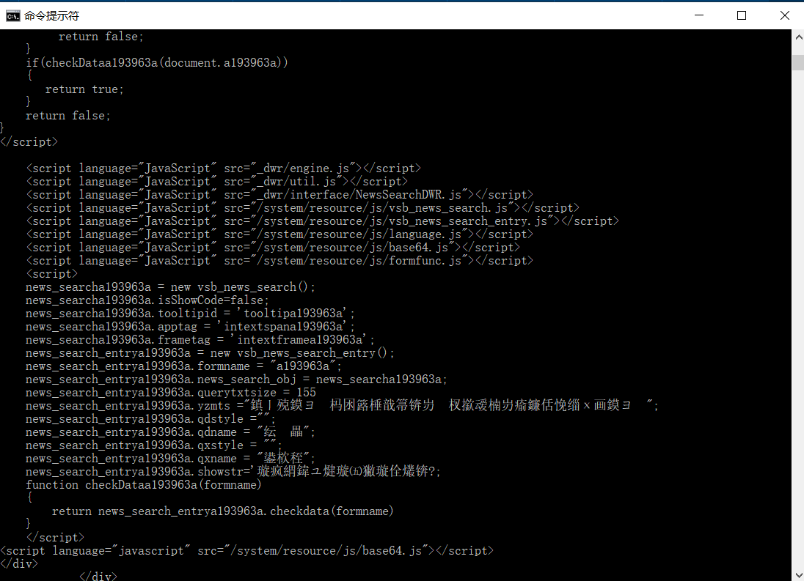
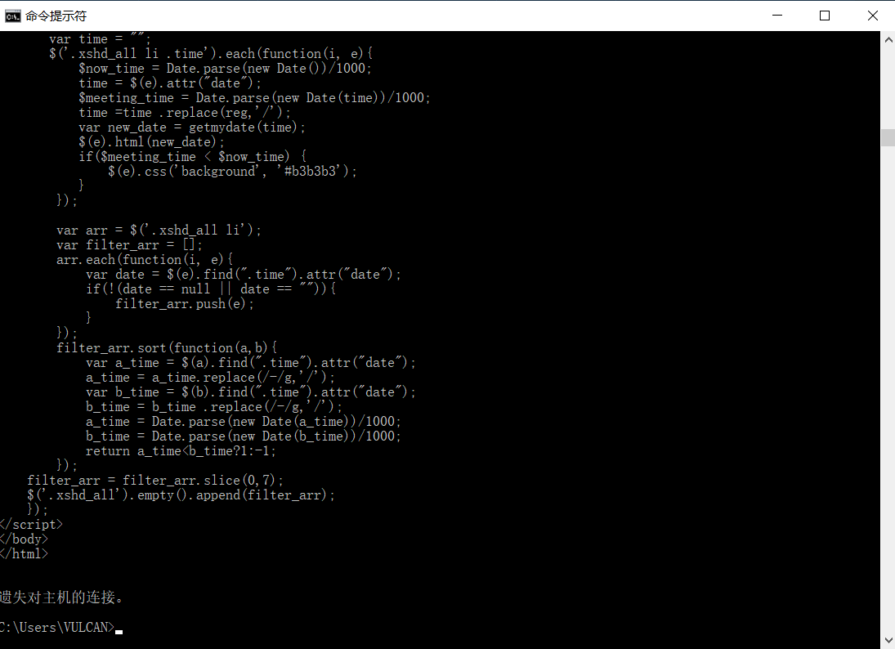

一、上机部分

1.ntelnet whu.edu.cn 25

2.ntelnet maths.whu.edu.cn 80     GET …

 

二、习题部分
P5.
a.
能
Tue, 07 Mar 2008 12:39:45 GMT
b.
Last-Modified: Sat, 10 Dec 2005 18:27:46 GMT
c.
Content-Length: 3874
d.
前五个字节："<!doc"
 keep-alive，所以同意持续连接

P8.
a.
2RTT0 + RTT1 + RTT2 + … + RTTn + 8 * 2 RTT0 = 18 RTT0 + RTT1 + RTT2 + … + RTTn
b.
2RTT0 + RTT1 + RTT2 + … + RTTn + 2 * 2 RTT0 = 6 RTT0 + RTT1 + RTT2 + … + RTTn
c.
2RTT0 + RTT1 + RTT2 + … + RTTn + RTT0 = 3 RTT0 + RTT1 + RTT2 + … + RTTn
