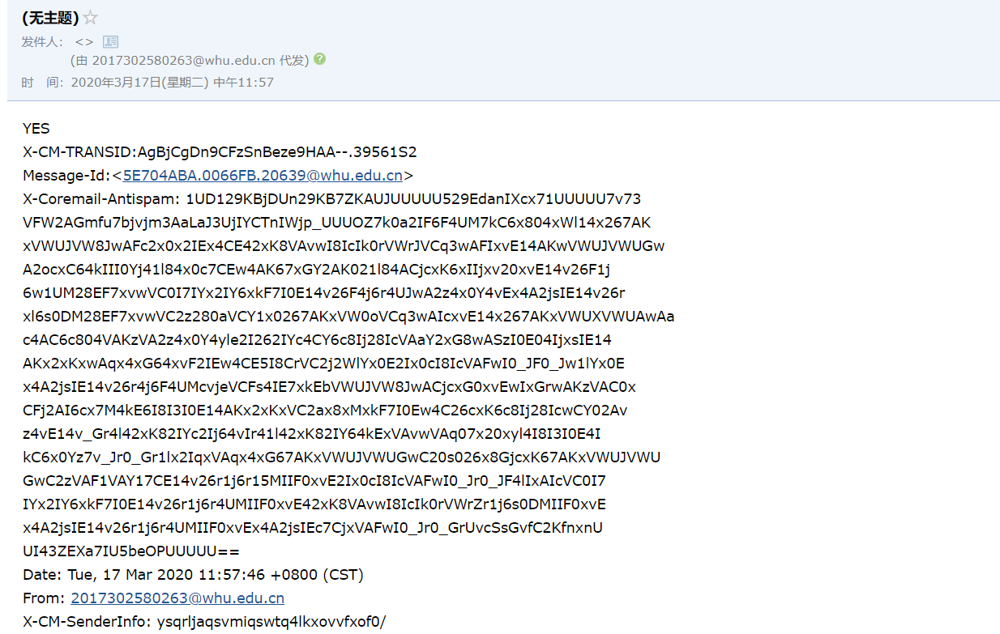
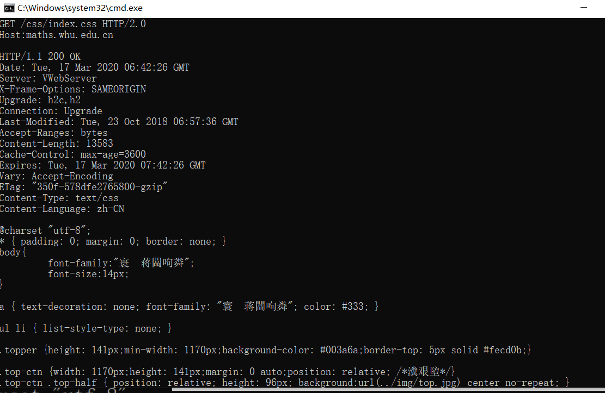

## telnet whu.edu.cn 25  
1.打开cmd，输入telnet whu.edu.cn 25  
2.输入ehol Sue  
3.输入auth login进行登录  
4.输入经过64base加密的账号和密码，其中账号为2017302580263@whu.edu.cn  
5.分别设置发送者接收者，其中接收者为我的qq邮箱794525298@qq.com  
6.输入内容
在cmd中显示以及输入的内容如下，最终发送邮箱结果如图。
```
telnet whu.edu.cn 25
220 whu.edu.cn Anti-spam GT for Coremail System (whu[20171226]
EHLO login
250-mail
250-PIPELINING
250-AUTH LOGIN PLAIN
250-AUTH=LOGIN PLAIN 
250-coremail 1Uxr2xKj7kG0xkI17xGrUDI0s8FY2U3Uj8Cz28x1UUUUU7Ic2I0Y2UrcZH-8UCa0xDrUUUUj 
250-STARTTLS
250-SMTPUTF8
250 8BITMIME 
auth login
334 dXNlcm5hbWU6
MjAxNzMwMjU4MDI2M0B3aHUuZWR1LmNu   (2017302580263@whu.edu.cn 经过64base加密)
334 UGFzc3dvcmQ6
******password       经过64base加密
MAIL FROM:<2017302580263@whu.edu.cn>250 Mail OK
RCPT TO:<794525298@qq.com>250 Mail OK   
DATA502 Error: command not implemented 
DATA354 End data with <CR><LF>.<CR><LF>  
YES  
.  
250 Mail OK queued as AgBjCgDn9CFzSnBeze9HAA--.39561S2 
QUIT   
```



## telnet maths.whu.edu.cn 80

```
telnet maths.whu.edu.cn 80
(输入ctrl+]进入telnet client)
GET /kxyj/xsjz/31.htm HTTP/2.0
Host: maths.whu.edu.cn
```



# 课后习题
## 第二章 P7
得到IP地址的时间为 RTT1 + RTT2 + … + RTTn  
三次握手加上最后的响应的时间为 2 RTT0  
因此总时间为 2 RTT0 + RTT1 + RTT2 + … + RTTn
## 第二章 P13
mail from是 SMTP 握手协议的一部分，而from是邮件报文的一部分
