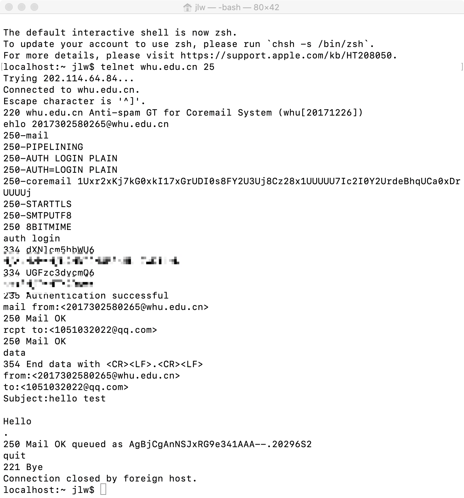
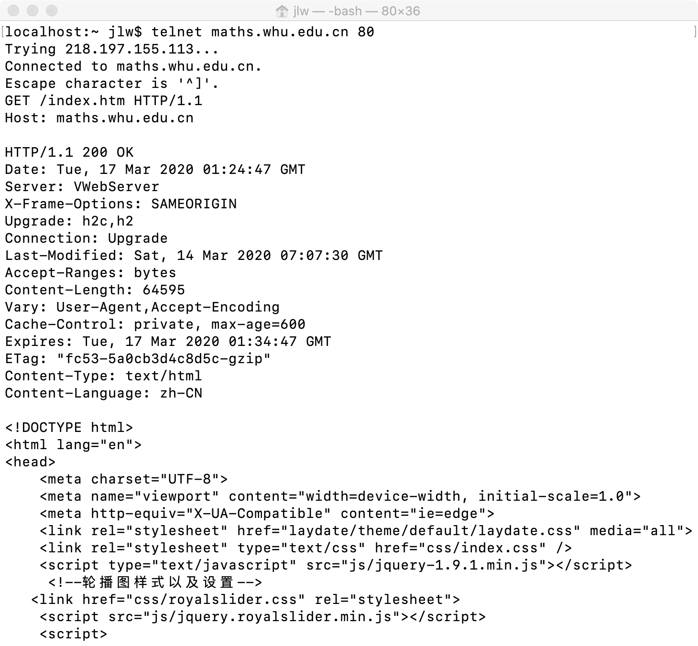

## 作业3
**1、telnet whu.edu.cn 25**
```
执行telnet whu.edu.cn 25
输入 ehlo 发送端主机名
输入 auth login 登陆邮箱，并输入base64后的用户名和密码
依次输入发送者和接受者邮箱
输入DATA命令，开始输入邮件内容
按照格式输入后以<CR><CF>.<CR><CF>结束，并发送邮件。
输入quit关闭连接
```


**2、telnet maths.whu.edu.cn 80**
```
执行 telnet maths.whu.edu.cn 80
构造HTTP报文，并发送

GET /index.htm HTTP/1.1\r\n
Host:maths.whu.edu.cn\r\n
\r\n

收到服务器成功响应内容。
```



**P3**
```
应用层：DNS、HTTP
传输层：UDP、TCP
```

**P4**
```
a. URL是http://gaia.cs.umass.edu/cs453/index.html, header中Host字段表示服务器名，请求首行 /cs453/index.html表示文件路径。
b. HTTP1.1，请求首行中HTTP/1.1表示HTTP协议版本。
c. 持续链接，header中Connection:keep-alive字段表示这是一条持续链接。
d. HTTP报文中不包含客户端IP地址
e. Mozilla/5 0 (Windows;U; Windows NT 5.1; en-US; rv:1•7•2) Geeko/20040804 Netscape/7 2 (ax)，
   header中User-Agent字段表示客户端类型，服务器可以根据浏览器类型信息将同一对象的不同版本发送到不同类型的浏览器，从而兼容不同客户端。
```
