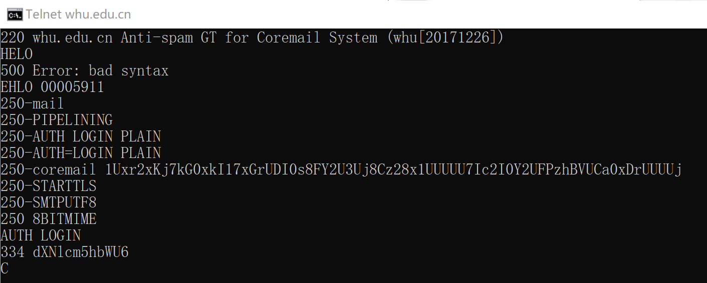
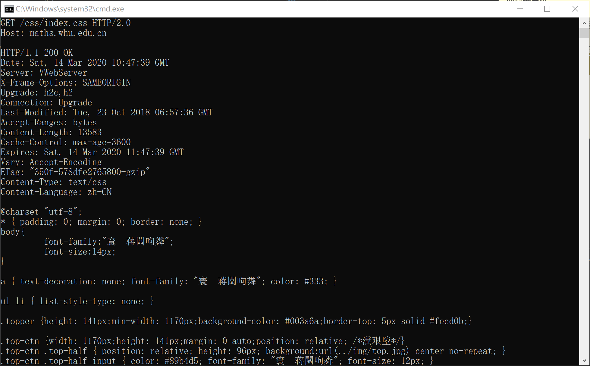

# 网络分布式作业-3
## **telnet**
    
    Telnet协议是`TCP/IP`协议族中的一员，是Internet远程登录服务的标准协议和主要方式。它为用户提供了在本地计算机上完成远程主机工作的能力。
```
telnet whu.edu.cn 25
```

```
telnet maths.whu.edu.cn 80
```


## **课后习题**
    
* p1:

    a. 非，客户将发送4个报文，分别请求html以及三幅图像。

    b. 是,开启持续性连接后相同客户端与服务端可以通过同一个连接发送多个内容。

    c. 非，非持续性连接每个请求对象都要重写建立一次连接。

    d. 非，Date指示服务器产生并发送该响应报文的日期和时间。Last-Modified指示最后修改的时间。

    e. 非。
* p3

    应用层：还需要DNS来解析域名。
    传输层：TCP(用以建立THHP) UDP(DNS)。
* p4

    (a) gaia.cs.umass.edu/cs453/index.html  在请求行和头部行的Host域。

    (b) THHP/1.1 在请求行。

    (c) 持续，在头部行的Connection域。

    (d) 不详。

    (e) Mozilla/5.0 在头部行的User-Agent域 用于告知服务器浏览器类型以发送特定内容。