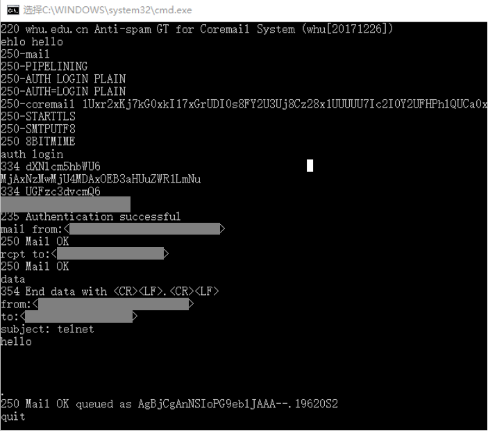
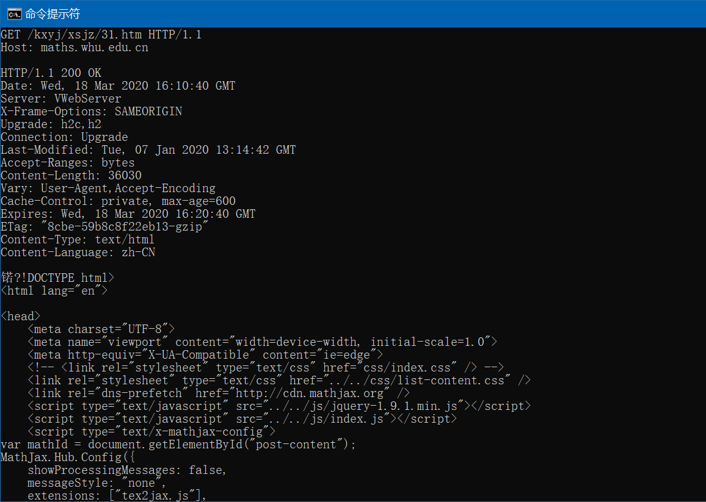
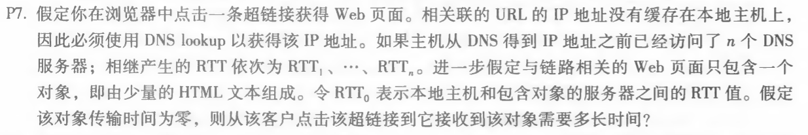
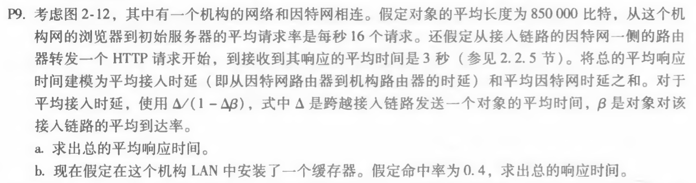

# 网络与分布式计算作业3

## telnet whu.edu.cn 25

首先将telnet指令在windows功能中启用  

然后输入

```
telnet whu.edu.cn 25
```

根据smtp协议与服务器的交互如下图所示：  


## telnet maths.whu.edu.cn 80

1. 连接数学网站80端口

- telnet maths.whu.edu.cn 80

2. 发送GET请求

- ctrl+]
- enter
- GET /kxyj/xsjz/31.htm HTTP/1.1  
Host: maths.whu.edu.cn
- enter, enter

接收到服务器发来的网页：


## 第二章课后题

### P7



**解答：**

得到IP地址的时间：T1 = RTT1 + RTT2 + … + RTTn  
响应时间：T2 = 2 * RTT0  
总时间：T = T1 + T2 = 2RTT0 + RTT1 + … + RTTn

### P9



**解答：**

a.
平均因特网时延：T1 = 3s  
$\Delta$ = 850000b / 15Mbps = 0.0567s  
$\beta$ = 16 requests/sec  
平均接入时延：T2 = $\Delta$ / (1 - $\Delta$*$\beta$) = 0.61s  
平均响应时延：T = T1 + T2 = 3.61s

b.命中缓存时：T1 = 850000b / 100Mbps = 0.0085s

未命中缓存时：  
平均因特网时延：T2 = 3s  
$\beta1$ = $\beta$ * 0.6 = 9.6 requests/sec  
平均接入时延：T3 = /（1-$\Delta$ * $\beta1$） = 0.12s

总响应时间：T = 0.4 \* T1 + 0.6 \* (T2+T3) = 1.88s
