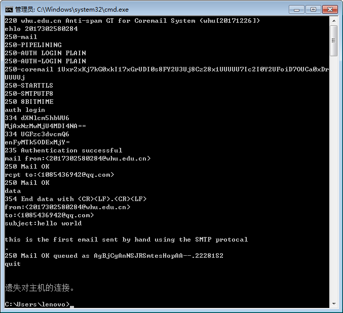
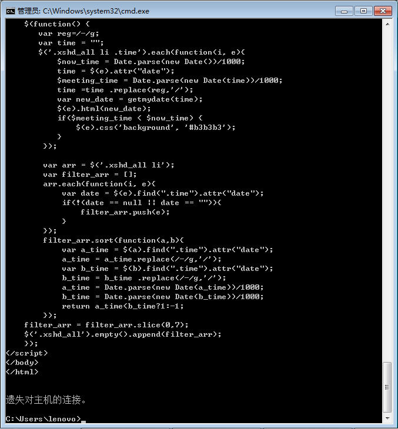

## telnet whu.edu.cn 25

* ehlo指令是对helo的扩展,支持用户认证;

* auth login指令表示身份验证开始;

* 之后输入base64编码过的用户名和密码进行身份验证;

* mail from声明邮件来源email地址,rcpt tp声明目标地址;

* data表示邮件开始,subject代表邮件主题,from和to在邮件头声明来源和目标,空行区分邮件头和内容,“.”号表示邮件结束;

* quit指令断开连接;

 注: 最好先把指令写在记事本等工具上,telnet的退格键可能无效.

发送成功如下图:

## telnet maths.whu.edu.cn 80

* 输入telnet maths.whu.edu.cn 80访问数院官网的http服务;

* 输入GET /index.htm HTTP/1.1回车;

* 输入Host: maths.whu.edu.cn回车获得首页的信息;

## 课后题
#####  P7. 假定你在浏览器中点击一条超链接获得Web页面。相关联的URL的IP地址没有缓存在本地主机上,因此必须使用DNS lookup以获得该IP地址。如果主机从DNS得到IP地址之前已经访问了n个DNS服务器;相继产生的RTT依次为RTT1、...、RTTn。进一步假定与链路相关的Web页面只包含一个对象，即由少量的HTML文本组成。令 RTT0表示本地主机和包含对象的服务器之间的RTT值。假定该对象传输时间为零，则从该客户点击该超链接到它接收到该对象需要多长时间?

获得ip时间:RTT1+RTT2+...+RTTn
与目标服务器时间:2RTT0
总时间:2RTT0+RTT1+RTT2+...+RTTn

##### P8. 参照习题P7,假定在同一服务器上某HTML文件引用了8个非常小的对象。忽略发送时间，在下列情况下需要多长时间:
######     a.没有并行TCP连接的非持续HTTP。

时间:2RTT0+RTT1+RTT2+...+RTTn+8x2RTT0=18RTT0+RTT1+RTT2+...+RTTn

######     b.配置有5个并行连接的非持续HTTP。

时间:2RTT0+RTT1+RTT2+...+RTTn+2x2RTT0=6RTT0+RTT1+RTT2+...+RTTn

######     c.持续 HTTP。

时间:2RTT0+RTT1+RTT2+...+RTTn+RTT0=3RTT0+RTT1+RTT2+...+RTTn

