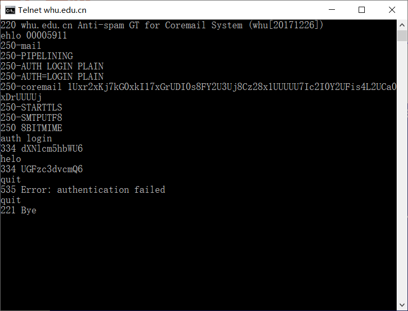
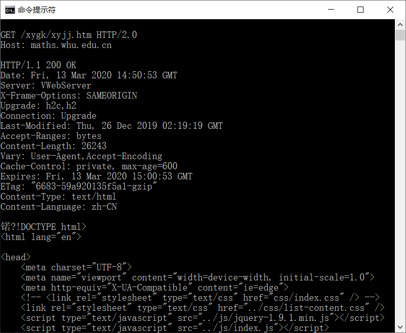

# talnet截图

**telnet whu.edu.cn 25**

**telnet maths.whu.edu.cn 80**

执行语句后，要用ctrl+“】”，再输入get命令执行，效果如下：

# 第二章习题

> **P9:**
>
> **a.**
>
> 850000b = 0.85Mb
> Δ = 0.85Mb/15Mbps = 0.0567s
> β = 16/s
> 平均接入时延 = 0.0567/(1-0.0567 * 16) = 0.611s
> 总平均响应时间 = 3+0.611 =3.611s
>
> **b.**
>
> β = 16 * 0.6 = 9.6/s
> 平均接入时延 = 0.0567/(1-0.0567 * 9.6) = 0.124s
> 命中时的总响应时间 = 0.85Mb/100Mbps = 0.0085s
> 非命中时的总的平均响应时间 = 3 + 0.124 = 3.124s
> 总的平均响应时间 = 0.0085 * 0.4 + 3.124 * 0.6 = 0.0034 + 1.8744 = 1.8778s

> **P10:**
>
> 总共包含一个初始对象和10个引用的对象。
> 仅考虑独占时通过短链路的时间。
> 一个控制分组通过短链路的时间为：
> t1 = 200/150 = 1.33s
> 一个数据分组通过短链路的时间。
> t2 = 100k/150= 666.67s
> 如果采用非持续HTTP的并行下载：
> 下载初始对象时，独占短链路，时间为 3 * t1 + t2 = 670.66s
> 同时下载10个引用对象，每个连接获得的1/10的链路带宽。
> 由于数据分组长度相同，控制分组长度也相同，而且平均分配带宽，因此时间相同。
> (3 * t1 + t2 ) * 10 = 6706.6s
> 总时间为 7377.26s
> 如果采用持续HTTP的下载：
> 下载初始对象时，独占短链路，时间为 3 * t1 + t2 = 670.66s
> 依次下载10个引用对象，由于不需要握手，只需要发送10个请求分组，而且连续发送，不需要均分带宽。
> （t1 + t2） * 10 = 6680s
> 总时间为 7350.66s
> 实际时间差距约为27s，也就少发了几条控制分组，相比总时间，基本没有减小。