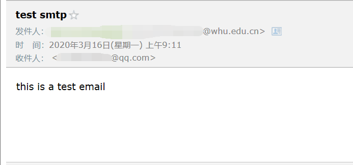
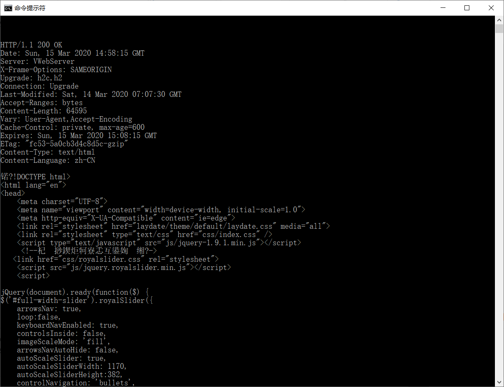

# 第三次作业

2017302580288 李沛昊

---

### 1、telnet whu.edu.cn 25

先在命令行输入一下命令，其中telnet指令须在在windows功能中启用。

```shell
telnet whu.edu.cn 25
```

然后根据smtp协议与服务器的交互如下：


发送邮件后打开收件人邮箱，发现邮件已经收到：



### 2、telnet whu.edu.cn 80

该题是利用telnet体验http协议。

先输入：

```shell
telnet maths.whu.edu.cn 80
```

然后在屏幕中输入以下内容:（如果需要看到自己输入的内容：需要按下CRTL+]，然后再回车）

```shell
GET / HTTP/1.1
Host:maths.whu.edu.cn\r\n
\r\n
```

接收到服务器发来的网页：



### 3、两道课后习题

#### P9

**题目**：

考虑图2-12,其中有一个机构的网络和因特网相连。假定对象的平均长度为850000比特，从这个机 构网的浏览器到初始服务器的平均请求率是每秒16个请求。还假定从接入链路的因特网一侧的路由 器转发一个HTTP请求开始，到接收到其响应的平均时间是3秒（参见2.2.5节）。将总的平均响应 时间建模为平均接人时延（即从因特网路由器到机构路由器的时延）和平均因特网时延之和。对于 平均接入时延，使用$\Delta/（1-\Delta\beta）$，式中$\Delta$是跨越接入链路发送一个对象的平均时间，$\beta$是对象对该接入链路的平均到达率。

 a. 求出总的平均响应时间。

 b. 现在假定在这个机构LAN中安装了一个缓存器。假定命中率为0.4,求出总的响应时间。

---

**解答**：

a、$\Delta = \frac{850000b}{15Mbps} = 0.057s$

$\beta=16s^{-1}$

所以,平均接入时延$=\Delta/(1-\Delta\beta)=0.64s$

综上所述，平均响应时间 $=d+d_{http}=0.64s+3s=3.64s$

b、

$\beta^{'}=16*0.6s^{-1}=9.6s^{-1}$

此时平均接入时延=$\Delta/(1-\Delta\beta^{'})=0.13s$

还要考虑命中响应时间=$\frac{850000b}{100Mbps}=0.0085s$

综上所述平均响应时间=$0.4*命中响应时间+0.6*（平均接入时延+平均因特网时延）=0.4*0.0085s+0.6*(0.13s+3s)=1.88s$

#### P10

**题目：**

考虑一条10米短链路，某发送方经过它能够以150bps速率双向传输。假定包含数据的分组是 100 000比特长，仅包含控制（如ACK或握手）的分组是200比特长。假定N个并行连接每个都获 得$1/N$的链路带宽。现在考虑HTTP协议，并且假定每个下载对象是100Kb长，这些初始下载对象 包含10个来自相同发送方的引用对象。在这种情况下，经非持续HTTP的并行实例的并行下载有意 义吗？现在考虑持续HTTP。你期待这比非持续的情况有很大增益吗？评价并解释你的答案。 

---

**解答：**

由于链路长度短，我们假设传播时延可以忽略。

基于非持续HTTP的并行下载总时延为：

$d=3*\frac{200b}{150bps}+\frac{100Kb}{150bps}+3*\frac{200b}{150bps/N}+\frac{100Kb}{150bps/N}=7377.3s$

基于持续HTTP的时延为：

$d^{'}=3*\frac{200b}{150bps}+\frac{100Kb}{150bps}+N(\frac{200b}{150bps}+\frac{100Kb}{150bps})=7352.6s$

可以发现，持续HTTP有很微小的增益。这是因为持续HTTP主要的好处在于减少发送控制分组所占用的时间。但在这个例子中，控制分组的发送时间只占据总耗时很小的一部分，因此对于整体传输用时增益不大。