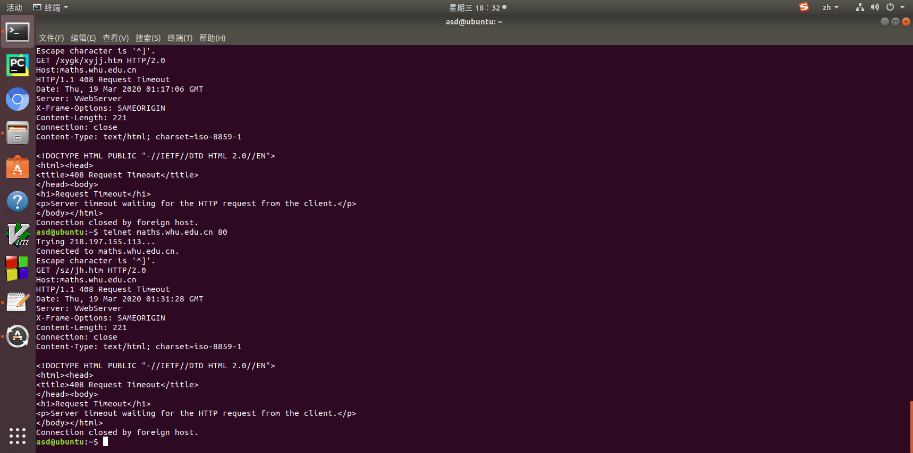
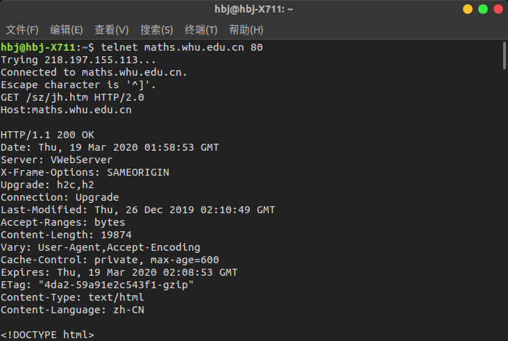

# 第三次作业
2017302580289/卢羽帆

------

## 第2章习题P3
除了 HTTP外，还需要的运输层协议是：TCP UDP，应用层协议是：DNS

## 第2章习题P4
a.查看"HOST:"可知，请求的URL是gaia.cs.umass.edu
b.在请求行查看HTTP版本是1.1
c.持续连接
d.无法通过HTTP GET报文得到主机的IP
e.查看"User-agent:"可知，浏览器版本是Mozilla/5.0（可能是火狐浏览器）

------
## telnet实践-SMTP
1.首先在“控制面板”的“启用或关闭”中打开“telnet client”
2.输入“cmd”打开终端，输入“telnet whu.edu.cn 25”
3.输入“ehlo 用户名（289）”
4.输入“auth login”
5.输入base64加密的邮箱账号和密码，验证失败（可能是初始密码有误），上述操作截图如下：
 
6.因为我的武大邮箱的账号密码遗失，联系管理员还没有得到结果，所以改用163邮箱进行后续操作，操作与上述相似，但是163邮箱使用的密码是授权码不是邮箱密码
7.输入“mail from:”发件人和“rcpt to:”收件人
8.输入“data”
9.输入邮件内容
10.输入“.”
11.发送完毕输入quit断开连接

## telnet实践-HTTP GET
1.输入“telnet maths.whu.edu.cn 80”
2.输入“GET /xygk/xyjj.htm HTTP/2.0 
Host：maths.whu.edu.cn”等多个页面都失败，显示408 request timeout

3.在同学电脑上进行相同尝试，成功（目前没有找到原因）

