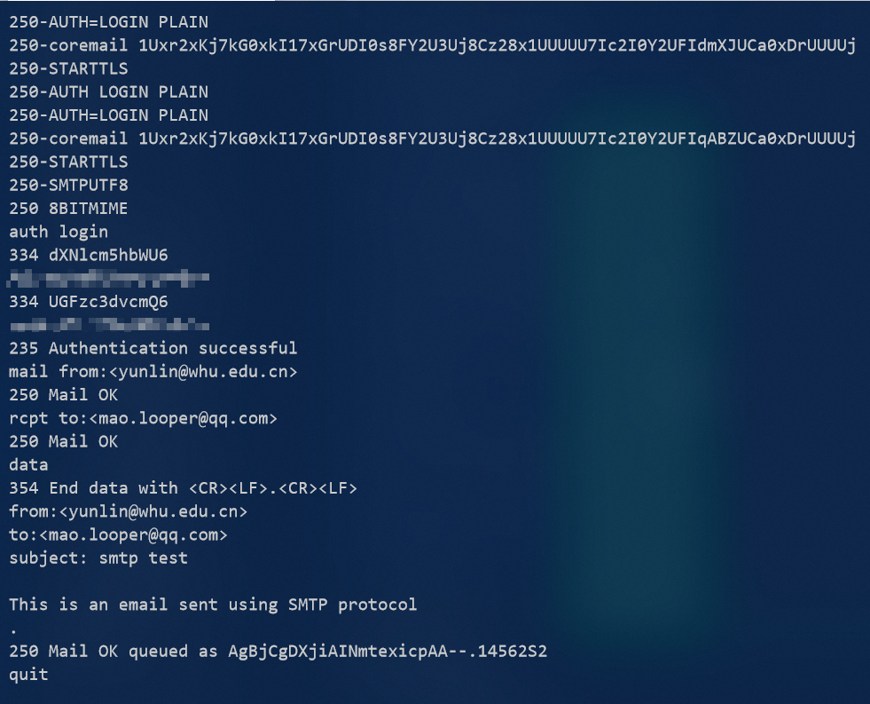
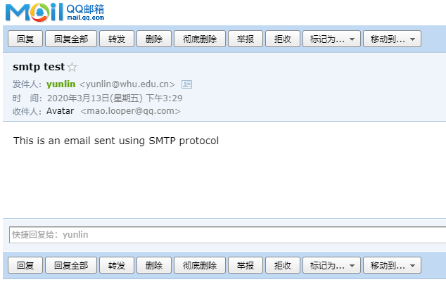
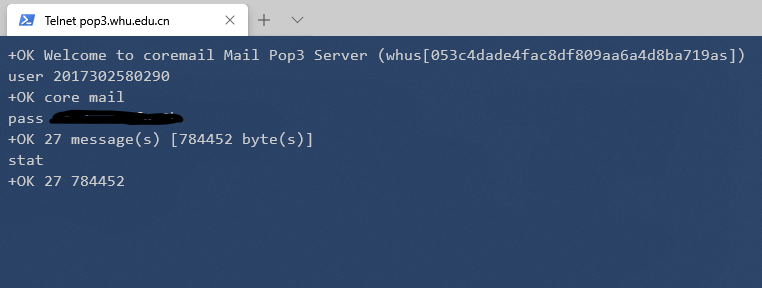
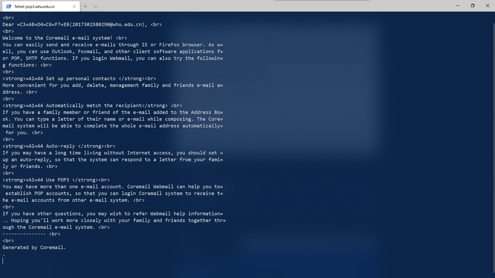
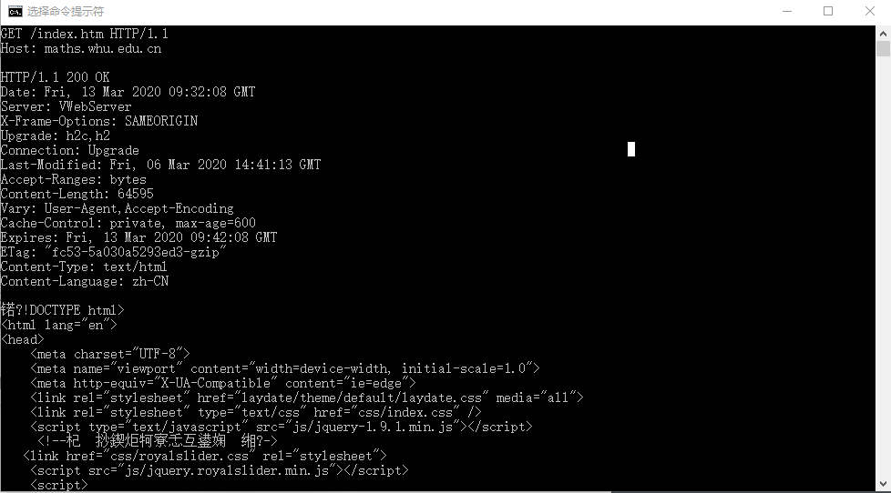
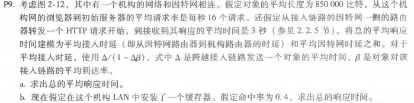
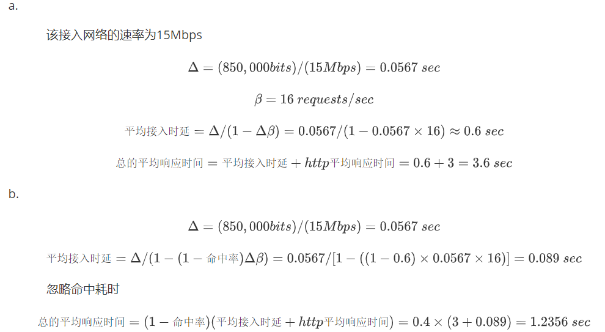
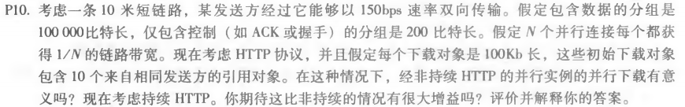
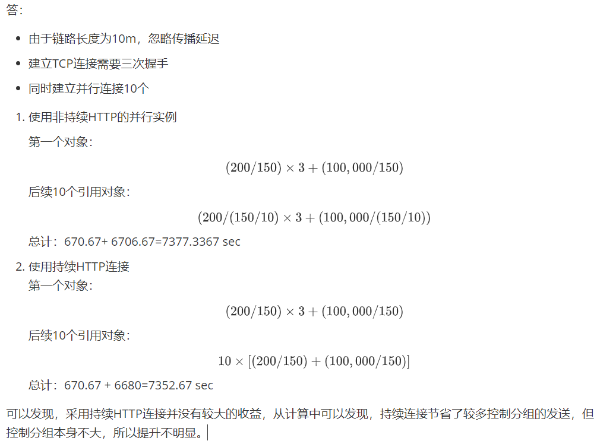

# Telnet邮箱

## SMTP发送邮件

```shell
c:telnet whu.edu.cn 25
c:ehlo me #发件人姓名
s:220 whu.edu.cn Anti-spam GT for Coremail System (whu[20171226])
250-mail
250-PIPELINING
250-AUTH LOGIN PLAIN
250-AUTH=LOGIN PLAIN
250-coremail 1Uxr2xKj7kG0xkI17xGrUDI0s8FY2U3Uj8Cz28x1UUUUU7Ic2I0Y2UrM4U1DUCa0xDrUUUUj
250-STARTTLS
250-SMTPUTF8
250 8BITMIME
c:auth login
s:334 dXNlcm5hbWU6 #username:
c: #base64编码后的用户名
s:334 UGFzc3dvcmQ6 #password:
c: #base64编码后的密码
s:235 Authentication successful
c:mail from:<yunlin@whu.edu.cn>
s:250 Mail OK
c:rcpt to:<mao.looper@qq.com>
s:250 Mail OK
c:data
from:<yunlin@whu.edu.cn>
to:<mao.looper@qq.com>
subject: smtp test

This is an email sent using SMTP protocol
.
c:quit
s:220 bye
```



成功接收



## POP3查看邮件

```
telnet pop3.whu.edu.cn 110
user 2017302580290
pass xxx
stat
retr

```





# Telnet网站

```
telnet maths.whu.edu.cn 80
<Ctrl+]>
<Enter>
GET /index.htm HTTP/1.1
Host: maths.whu.edu.cn
<Enter>
<Enter>

------
# 响应消息
HTTP/1.1 200 OK                               
Date: Fri, 13 Mar 2020 09:32:08 GMT                             
Server: VWebServer                                   
X-Frame-Options: SAMEORIGIN                              
Upgrade: h2c,h2   
Connection: Upgrade           
Last-Modified: Fri, 06 Mar 2020 14:41:13 GMT    
Accept-Ranges: bytes                 
Content-Length: 64595                   
Vary: User-Agent,Accept-Encoding    
Cache-Control: private, max-age=600  
Expires: Fri, 13 Mar 2020 09:42:08 GMT 
ETag: "fc53-5a030a5293ed3-gzip"
Content-Type: text/html
Content-Language: zh-CN
```



# 课本习题

## P9





## P10





---


*原公式*

p9:

a. 		

​			该接入网络的速率为15Mbps
$$
\Delta = (850,000bits)/(15Mbps)=0.0567 \ sec
$$

$$
\beta = 16 \ requests/sec
$$

$$
平均接入时延=\Delta /(1-\Delta \beta)=0.0567/(1-0.0567\times 16)\approx 0.6\ sec
$$

$$
总的平均响应时间= 平均接入时延 + http平均响应时间 = 0.6+3=3.6\ sec
$$

b. 
$$
\Delta = (850,000bits)/(15Mbps)=0.0567 \ sec
$$

$$
平均接入时延=\Delta /(1- (1-命中率)\Delta \beta)=
0.0567 /[1-((1-0.6)\times 0.0567 \times 16)]=0.089 \ sec
$$
​			忽略命中耗时
$$
总的平均响应时间=(1-命中率) (平均接入时延 + http平均响应时间) =0.4\times (3+0.089)=1.2356\ sec
$$

p10:
答：

- 由于链路长度为10m，忽略传播延迟
- 建立TCP连接需要三次握手
- 同时建立并行连接10个

1. 使用非持续HTTP的并行实例

   第一个对象：
   $$
   (200/150)\times 3+(100,000/150)
   $$
   后续10个引用对象：
   $$
   (200/(150/10)\times 3+(100,000/(150/10))
   $$
   总计：670.67+ 6706.67=7377.3367 sec

2. 使用持续HTTP连接
   第一个对象：
   $$
   (200/150)\times 3+(100,000/150)
   $$
   后续10个引用对象：
   $$
   10\times [(200/150)+(100,000/150)]
   $$
   
   总计：670.67 + 6680=7352.67 sec

可以发现，采用持续HTTP连接并没有较大的收益，从计算中可以发现，持续连接节省了较多控制分组的发送，但控制分组本身不大，所以提升不明显。
