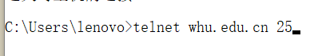
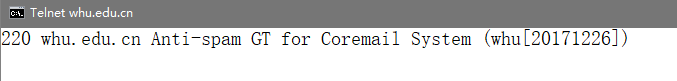
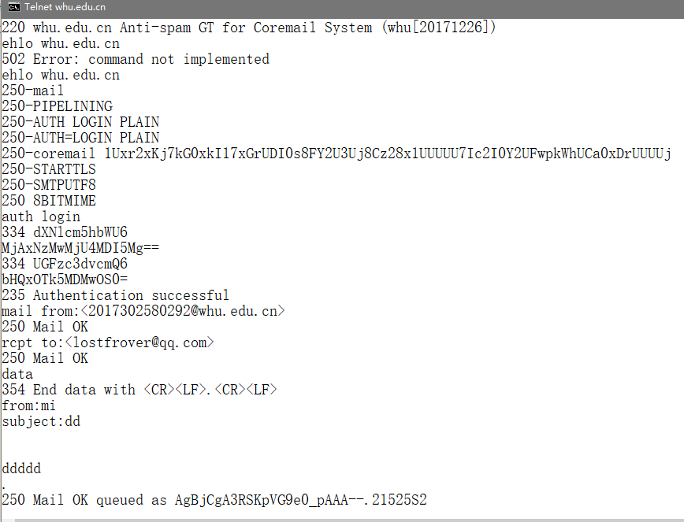
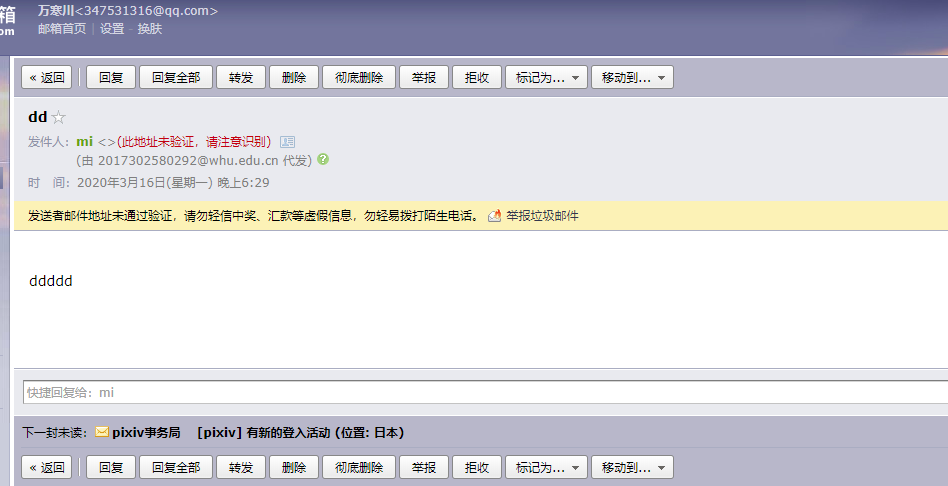
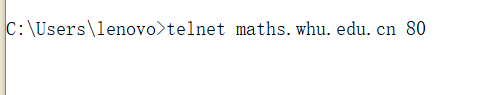
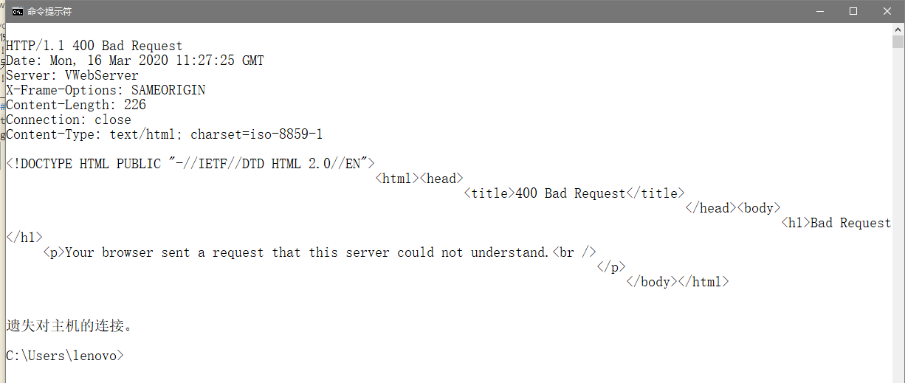
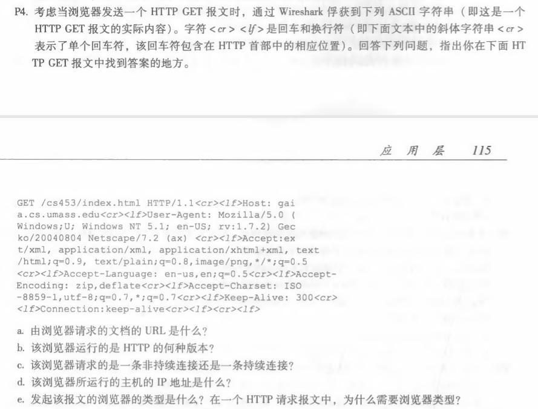
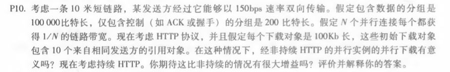

## telnet whu.edu.cn 25
在windows程序设置中开启Telnet客户端后，可以在控制台使用Telnet命令。 
 
得到连接成功的反馈 
 
使用EHLO命令，获得whu.edu.cn邮箱服务器的可行性反馈。之后填写邮件内容并发送
 
另一个邮箱收到的邮件
 
___
## telnet math.whu.edu.cn 80
使用Telnet命令连接 
 
服务器返回内容
 
___
## P4
 
~~~
a.从get的文件/cs453/index.html和host地址gaia.cs.umass.edu可以组合得到URL为
    http://gaia.cs.umass.edu/cs453/index.html
b.HTTP/1.1 指明运行的是http1.1版本
c.报文末尾的connection:keep-alive指明是持续连接
d.此信息无法从get报文中获得
e.User-Agent部分可获得Mozilla/5.0。服务器需要浏览器类型信息以将同一对象的不同版本发送到不同类型的浏览器。
~~~
___
## P10

~~~
十米的链路可忽略传播时延。
非持续：握手，下载初始对象，对引用对象并行握手后下载
t1  =3*(200b/150bps)+100000b/150bps+3*200b/(150/10)bps+100000b/(150/10)bps
    =7377.3s
持续：握手，下载初始对象，依次请求下载引用对象
t2  =3*(200b/150bps)+100000b/150bps+10*(200b/150bps+100000b/150bps)
    =7350.7s
该情况下，二者差异不大。
~~~
 
刘涛 2017302580292 2020.03.16
