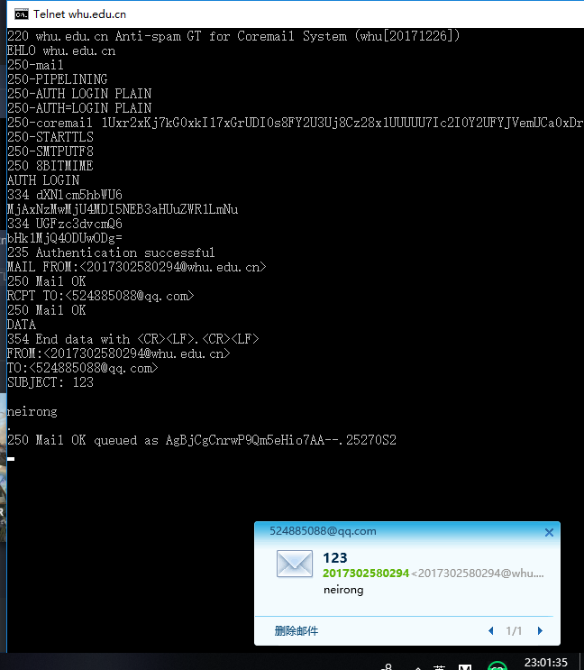
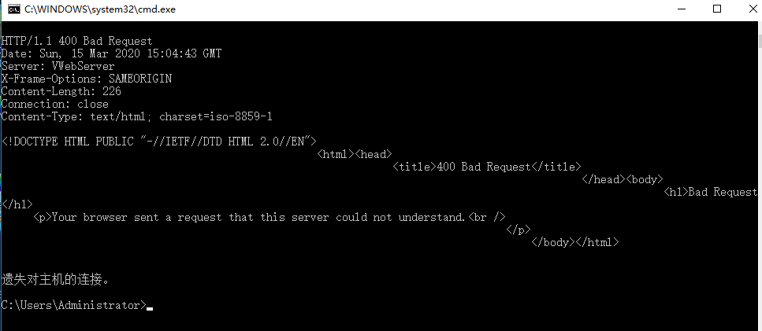
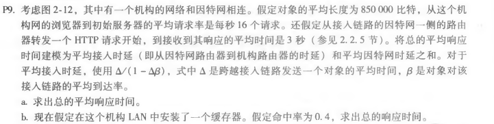
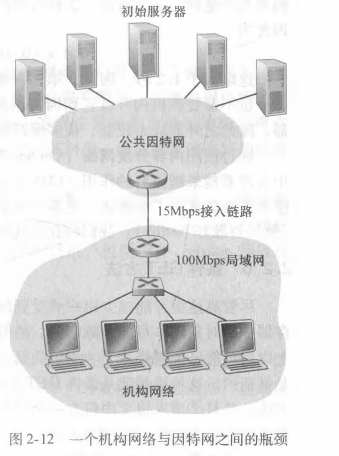
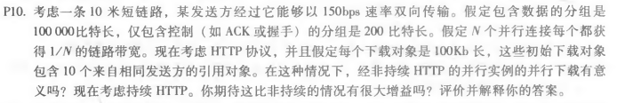

# 第三次作业
## 刘洋 2017302580294
whu.edu.cn:
maths.whu.edu.cn:
P9:
图2-12: 
(a)、Δ = 850000b / 15Mbps = 0.0567s 
&emsp;β = 16请求ps * Δ = 0.9072s 
&emsp;t1 = Δ / (1 - β) = 0.611s 
&emsp;t = t1 + t2 = 0.611s + 3s = 3.611s 
(b)、Δ = 850000b / 15Mbps = 0.0567s 
&emsp;β = 16请求ps * Δ * 0.6 = 0.54432s 
&emsp;t1 = Δ / (1 - β) = 0.1244s 
&emsp;t3 = 850000b / 100Mbps = 0.0085s 
&emsp;t = (t1 + t2) * 0.6 + t3 * 0.4 = 1.87464s + 0.0034s = 1.87804s 
P10: 
短链路长度为10米，传播时延可忽略 
并行非持续HTTP的T1 = 3*(200b/150bps) + 100000b/150bps + 3*(200b/(150bps/10)) + 100000b/(150bps/10) = 7377.3s 
持续HTTP的T2 = 3*(200b/150bps) + 100000b/150bps + 10*(200b/150bps + 100000b/150bps) = 7351s 
持续性HTTP比并行非持续性HTTP没有太大增益。