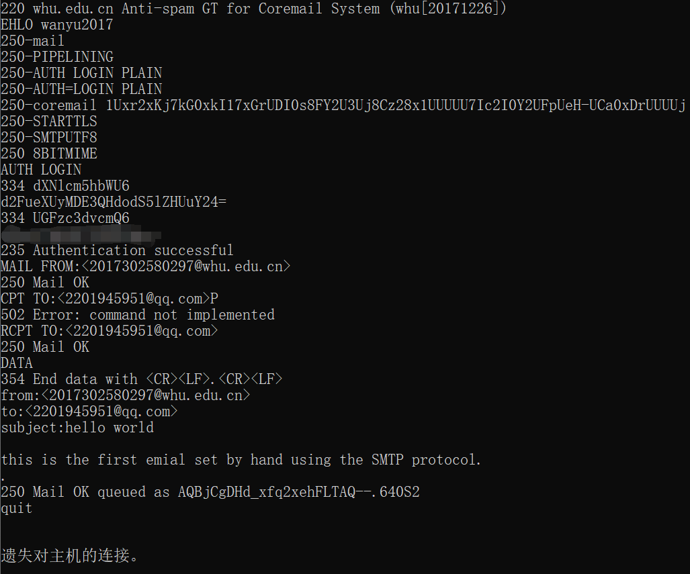
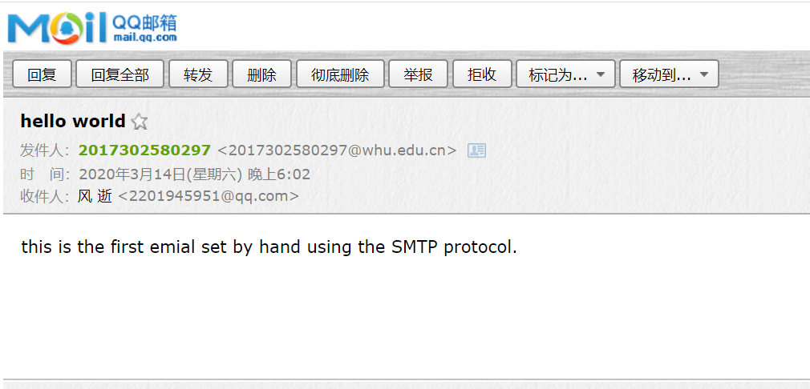
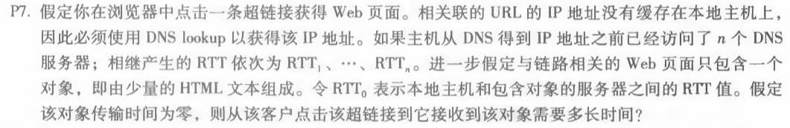
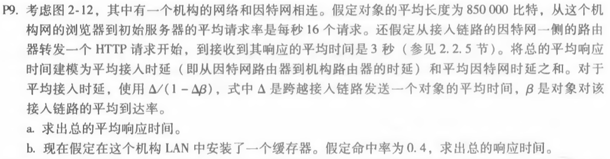

#### 1. telnet whu.edu.cn 25

操作步骤

```
EHLO wanyu2017 //登录用户
AUTH LOGIN //确认登录认证
MAIL FROM:<2017302580297@whu.edu.cn> //发件人地址
RCPT TO:<2201945951@qq.com> //收件人地址
DATA //输入内容
from:<2017302580297@whu.edu.cn>
to:<2201945951@qq.com>
subject:hello world

this is the first emial set by hand using the SMTP protocol.
. //结束
QUIT //退出
```

操作截图



收到邮件



#### 2. telnet maths.whu.edu.cn 80

操作步骤

```bash
GET /kxyj/xsjz/31.htm HTTP/1.0
HOST: maths.whu.edu.cn
```

操作截图


#### 3. 第二章习题 2.7



因为本地主机和服务器之间的响应时间需要RTT_0

在从DNS到得到IP之间又需要访问n个DNS服务器，分别需要RTT1、...、RTTn

所以一共需要的时间为
$$
T = 2RTT_0 + RTT_1 + ... + RTT_n
$$


#### 4. 第二章习题 2.9



a.

由平均传输时延为
$$
T_{trans} = L/R = 850000bit/15Mbps = 0.0567s 
$$
由平均接入链路时延为
$$
T_{acces} = \varDelta/(1-\varDelta\beta) = 0.0567s/[1-16req/s(0.0567s/req)] = 0.611s
$$
所以总的平均响应时间为
$$
T_{total} = T_{inter} + T_{acces} = 3s + 0.611s = 3.611s
$$
b. 

当LAN中安装Web缓存器，命中率为0.4

此时平均接入链路时延为
$$
T_{acces} = \varDelta/(1-0.4\varDelta\beta) = 0.0567s/[1-0.4\times16req/s(0.0567s/req)] = 0.089s
$$
此时平均响应时间为
$$
T_{total} = 0.4 T_{total} + 0.6(T_{inter}+T_{acces}) = 0.4\times0s + 0.6\times(3s + 0.089s) = 1.853s
$$

