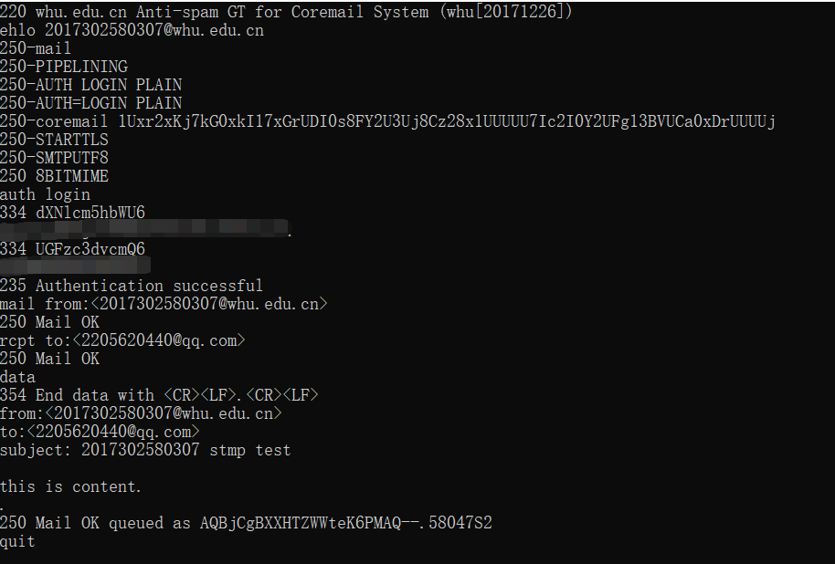
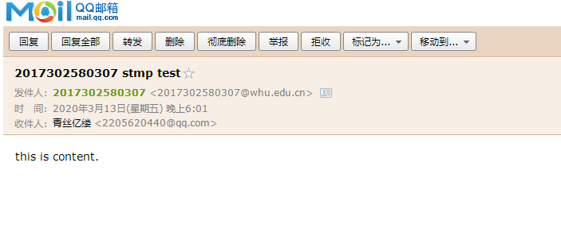
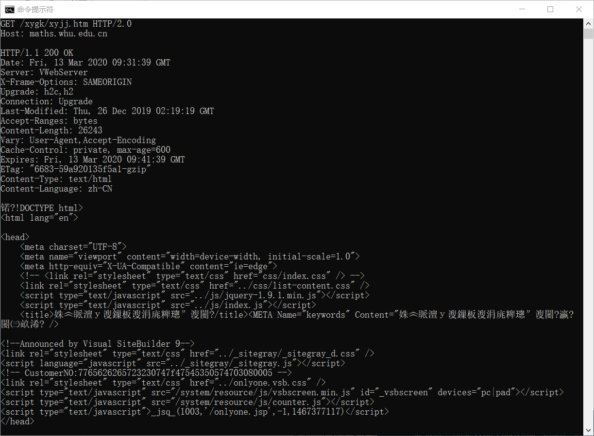

# HOMEWORK_3
- telnet whu.edu.cn 25
  - 操作步骤
    - 打开cmd，输入telnet whu.edu.cn 25
    - ehol 2017302580307@whu.edu.cn 告诉SMTP服务器发送者用户名
    - auth login 进行登录
    - 接下来分别输入邮箱用户名和密码的base64的编码，为了隐私考虑，图片打码
    - 设置发送人：mail from:<2017302580307@whu.edu.cn>
    - 设置接收人：rcpt to:<2205620440@qq.com>
    - 输入data，开始编辑邮件内容  
      ```
      from:<2017302580307@whu.edu.cn>  // 发件人地址
      to:<2205620440@qq.com> // 收件人地址
      subject: 2017302580307 stmp test  // 标题
      // 需要空一行

      this is content.  // 邮件内容
      ```
    - 输入. 结束邮件内容
    - quit 断开与邮件服务器的连接
  - 结果图如下
    
  
  ---
- telnet maths.whu.edu.cn 80
  - 操作过程中需要注意的点：
    - 在cmd中 输入telnet maths.whu.edu.cn 80后回车运行后不能直接粘贴
    - 需要Ctrl+]的组合建，然后连续两个回车，点击鼠标右键粘贴测试语句  
    GET /xygk/xyjj.htm HTTP/2.0  
    Host: maths.whu.edu.cn
    - 之后两次回车即可
  - 结果图如下
     
  ---
- 课后习题P4  
  a. 从host和get处得到：gaia.cs.umass.edu/cs453/index.html  
  b. 从GET方法那儿可以找到 http版本为1.1  
  c. connection:keep-alive 持续连接  
  d. 没有在报文中找到运行主机ip地址  
  e. Mozilla/5.0 可以针对不同的浏览器发送不同版本的网页  
- 课后习题P5  
  a. 状态码200，所以能。从Date那里得到时间：Tue, 07 Mar 2008 12:39:45 GMT
  b. Last-Modified：Sat, 10 Dec 2005 18:27:46 GMT  
  c. 从Content-Length得知长度为3874字节  
  d. 查看报文，发现返回一个html文件，一个字符和英文字母占一个字节，所以前五个字节为"<!doc"。keep-alive，所以同意一条持续链接。

