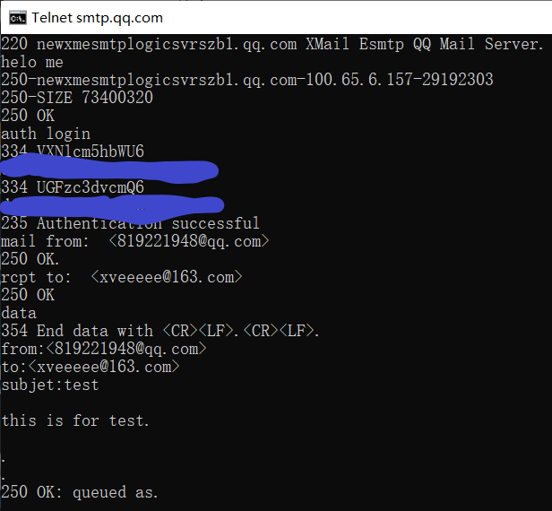

# 第三次作业

2017312580048 徐意

## telnet

### SMTP邮件

使用qq邮箱发送，武大邮箱被锁了

使用 telnet smtp.qq.com 命令进入telent命令页面

依次输入命令：

```
helo me		//和服务器打招呼
auth login 	//登录
@base64账号
@base64密码
mail form:  <发信邮箱地址>
rcpt to:  <收信邮箱地址>
data 		//开始写内容 用.结束输入
```



运行成功画面

中间要注意的地方:

- 账号密码要经过base64加密
- mail from 和 rcpt to命令冒号后面要跟两个空格
- 有授权码的邮箱密码用授权码代替

### get命令

输入 telnet maths.whu.edu.cn 80 进入命令页面

输入命令：

```
GET /index.htm HTTP/1.1
Host: maths.whu.edu.cn
```

回车回车，得到html文档


## 课后练习题

### p7


得到IP地址的时间 = RTT1 + RTT2 + … + RTTn
三次握手加上最后的响应 = 2 RTT0
因此总共是 2 RTT0 + RTT1 + RTT2 + … + RTTn

### P9


##### a:

$$
△=850000bits/15Mbps=0.057s
$$

$$
B=16/1s=16/s
$$

$$
平均接入时延=△(1-△B)=0.057*(1-0.57*16)=0.6s
$$

$$
平均响应时间=平均接入时延+平均因特网时延=3+0.6=3.6s
$$

##### b:

$$
忽略命中情况的时间
$$

$$
B'=B*(1-0.4)=7.2/S
$$

$$
平均接入时延'=△(1-△B')=0.057*(1-0.57*7.2)=0.12s
$$

$$
平均响应时间=0.4*0+0.6*（平均接入时延+平均因特网时延）=0.6*（3+0.12）=1.872s
$$

