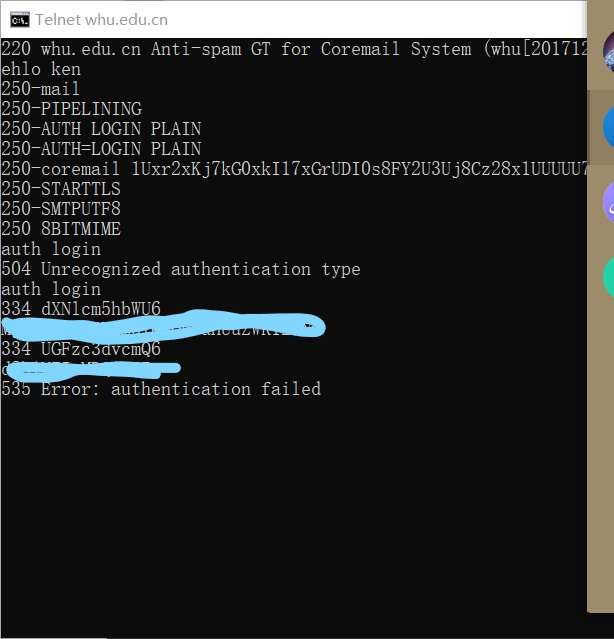
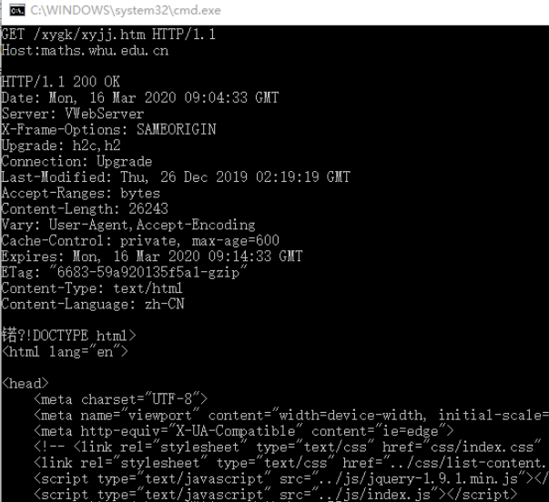

## 第三次作業

### 1.ntelnet whu.edu.cn 25  

> 作業步驗如下:
>
> * 輸入ehlo ken 
>
> * 輸入auth login 作自動登錄
>
> * 輸入用base64加密後的帳戶
>
> * 輸入用base64加密後的密碼
>
> * ```
>   輸入內容:mail from:2017312580243@whu.edu.cn>
>   rcpt to:<2985878064@qq.com>
>   data
>   from:<201731258024@whu.edu.cn>
>   to:<985878064@qq@qq.com>
>   subject: telnet
>   ken
>   .
>   quit
>   ```

但因帳號大久沒用所以被鎖了，登錄不成功

 

## 2.ntelnet maths.whu.edu.cn 80

> 作業步驗如下:
>
> * 輸入telnet maths.whu.edu.cn 80，然後按下按下Ctrl+]進行交互
> * 输入: GET /kxyj/xsjz/31.htm HTTP/1.1 Host: maths.whu.edu.cn

結果如下

 

## 第二章

> ### p7.
>
> * 答案:寻找IP的时间$RTT_1+...+RTT_n$。
>   本地主机和服务器建立连接时间$2RTT_0$
>   总时间：$RTT_1+...+RTT_n+2RTT_0$

> ### P10.
>
> * 答案:并行非持续HTTP的T1 = 3*(200b/150bps) + 100000b/150bps + 3*(200b/(150bps/10)) + 100000b/(150bps/10) = 7377.3s
>   持续HTTP的T2 = 3*(200b/150bps) + 100000b/150bps + 10*(200b/150bps + 100000b/150bps) = 7351s
>
>   所以沒有太大增益效果
